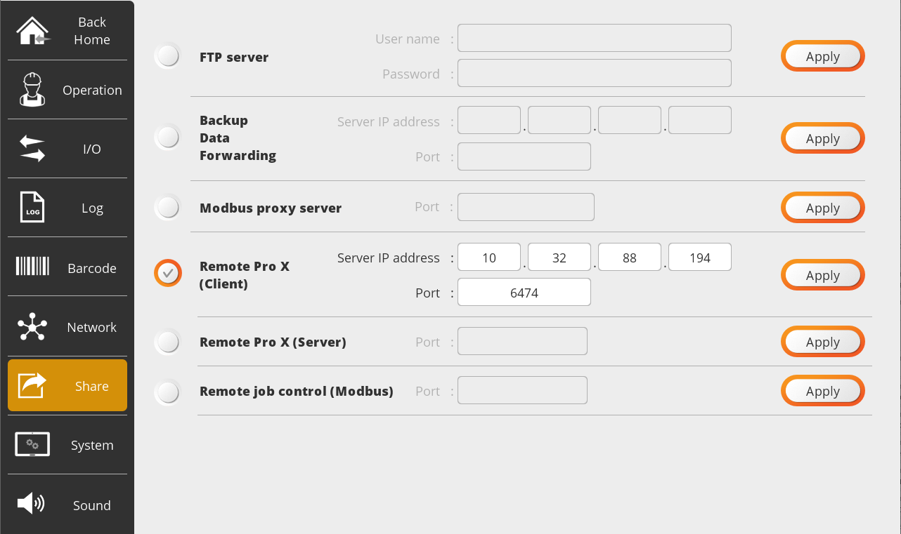
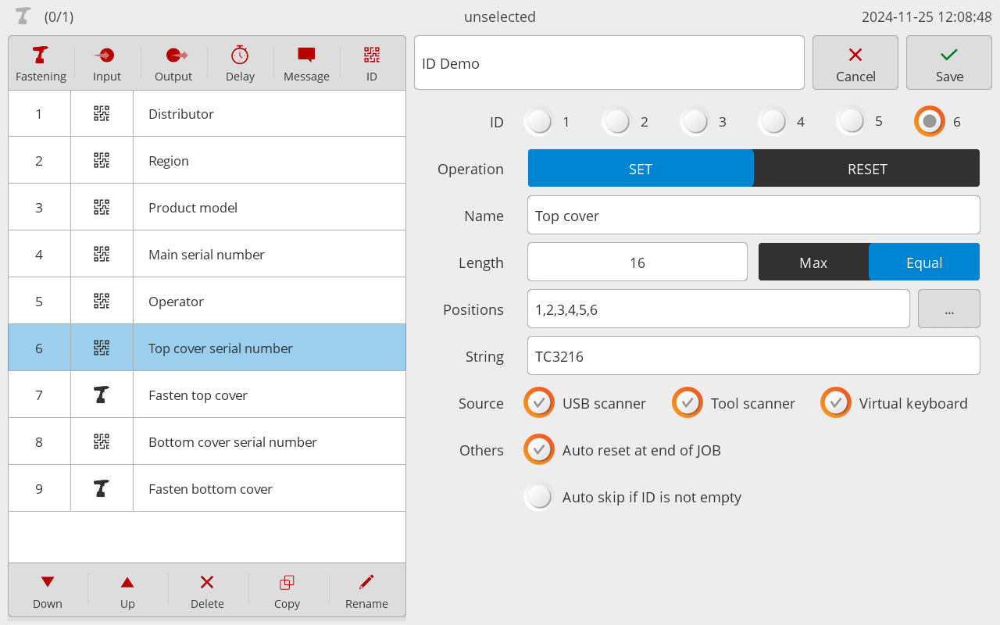
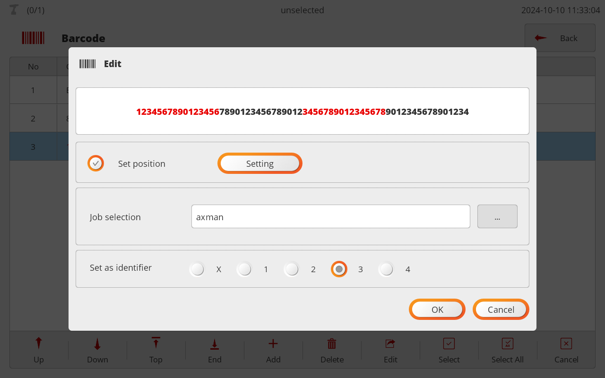
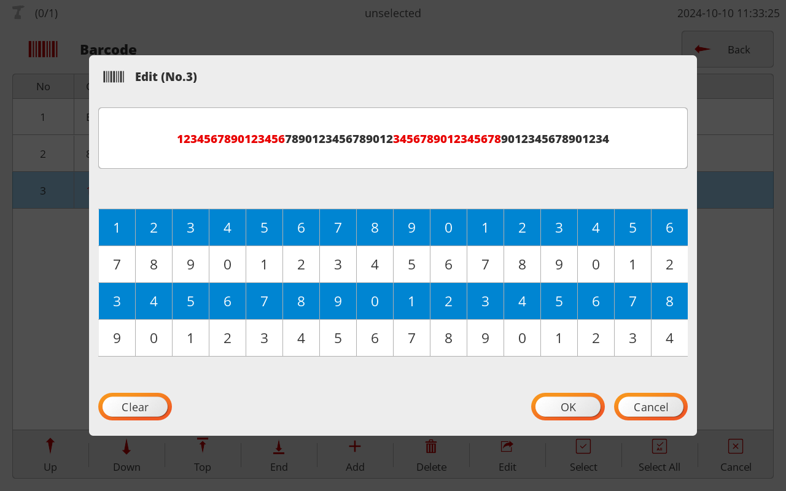

# ParaMon-Pro X : Remote-Pro X

> **출처(Source)**: Confluence — https://hantas.atlassian.net/wiki/x/PoAVD
> **Page ID**: 202735678 · **Space**: ko · **Version**: 10
> **가져온 날짜(Fetched)**: 2026-06-30
> **용도**: ParaMon Pro-X 지원 기능 구현을 위한 Remote-Pro X 프로토콜 참조 (로컬 보관용)

---

# 문서 개요

본 문서에서는 외부 장치에서 ParaMon-Pro X를 제어하기 위한 Remote-Pro X 프로토콜을 정의합니다.

# 개정 이력

| **Version** | **Date** | **Description** |
| --- | --- | --- |
| v 4.0.0 | 2023-12-19 | - 최초 작성 |
| v 4.1.0 | 2024-11-26 | - Add 5.5.2.4. Rev.3 - Add 5.5.3.4. Rev.3 - Change 8.1.Job file header - Change 8.2.4.Delay - Change 8.2.5.Message - Change 5.5.2.1.Rev.0 - Add 5.5.2.4. Rev.3 - Change 5.5.3.1. Rev.0 - Add 5.5.3.4. Rev.3 - Change 5.5.8.1. Rev.0 - Add 5.5.8.2. Rev.1 - Change 5.5.9.1. Rev.0 - Add 5.5.9.2. Rev.1 - Add 9. JOB code format - Change 8.2. Step data field - Change 8.2.1. Fastening - Add 8.2.6. ID |
| v 4.1.0 | 2024-12-17 | - Change 5.5.5. IO upload reply - Change 5.5.6. IO set request - Change 5.5.2.4. Rev.3 - Change 5.5.3.4. Rev.3 |
| v 4.1.0 | 2024-12-18 | - Change 5.8.2. Last event - Change 5.8.6. Old event reply |
| v 4.1.0 | 2024-12-20 | - Change 5.7.9.JOB event |
| v 4.1.0 | 2024-12-26 | - Change 5.7.9.JOB event |
| v 4.1.0 | 2024-12-27 | - Add 5.5.28. IO tool name upload request - Add 5.5.29. IO tool name upload reply |
| v 4.2.0 | 2025-02-03 | - Add Position control feature    - 4.MID list : MID 추가됨 120 ~ 124   - 5.10. Position (Encoder) Messages : 추가된 MID 파라메터   - 8. Pro X JOB file format : v0.3과 v1.0으로 분할 됨 |
| v 4.2.0 | 2025-03-12 | - 5.6.2.3. Rev.2 추가 - 5.5.2.5. Rev.4 추가 - 5.5.3.5. Rev.4 추가 - 5.5.8.3. Rev.2 추가 - 5.5.9.3. Rev.2 추가 |
| v 4.2.0 | 2025-05-08 | - 5.5.17.1. Rev.1 추가 - 5.5.18.2. Rev.1 추가 |
| v 4.2.0 | 2025-06-10 | - 5.5.14.2. Rev.1 추가 - 5.5.15.2. Rev.1 추가 |
| v 4.2.1 | 2025-07-03 | - 5.6.6. Multilingual version upload request 추가 - 5.6.7. Multilingual version upload reply 추가 - 5.6.8. Multilingual update & refresh request 추가 |
| v 4.2.1 | 2025-09-30 | - 5.8.2.1. Rev.0 Status Code 추가 - 5.8.2.2. Rev.1 Status Code, Job name, Step name, Tool name. NG cause 추가 - 5.8.6.1. Rev.0 Status Code 추가 - 5.8.6.2. Rev.1 Status Code, Job name, Step name, Tool name. NG cause 추가 |
| v 4.2.2 | 2025-11-25 | - 5.2.2. Member tool upload reply I/O 툴 추가에 따른 수정 - 5.8.2. Last event Tool index 범위 -1부터 - 5.8.6. Old event reply Tool index 범위 -1부터 |
| v4.3.0 | 2026-06-16 | - [Message 스텝 Operation type에 "3 = Minimum display time (sec)" 추가](https://hantas.atlassian.net/wiki/spaces/ko/pages/202735678/Remote-Pro+X+Specification#Message.1) - [Operation upload reply에 Rev.5 추가](https://hantas.atlassian.net/wiki/spaces/ko/pages/202735678/Remote-Pro+X+Specification#Rev.5) - [Operation set request에 Rev.5 추가](https://hantas.atlassian.net/wiki/spaces/ko/pages/202735678/Remote-Pro+X+Specification#Rev.5.1) - [Log upload reply Rev.1에서 “NG cause”를 “NG comment”로 이름만 변경](https://hantas.atlassian.net/wiki/spaces/ko/pages/202735678/Remote-Pro+X+Specification#Rev.1.2) - [Log set request Rev.1에서 “NG cause”를 “NG comment”로 이름만 번경](https://hantas.atlassian.net/wiki/spaces/ko/pages/202735678/Remote-Pro+X+Specification#Rev.1.3) - [Log upload reply에 Rev.3 추가](https://hantas.atlassian.net/wiki/spaces/ko/pages/202735678/Remote-Pro+X+Specification#Log-upload-reply) - [Log set request에 Rev.3 추가](https://hantas.atlassian.net/wiki/spaces/ko/pages/202735678/Remote-Pro+X+Specification#Log-upload-reply) - [Last event에 Rev.2 추가](https://hantas.atlassian.net/wiki/spaces/ko/pages/202735678/ParaMon-Pro+X+Remote-Pro+X#Rev.2.2) - [Old event reply에 Rev.2 추가](https://hantas.atlassian.net/wiki/spaces/ko/pages/202735678/ParaMon-Pro+X+Remote-Pro+X#Rev.2.3) |

# Message Structure

단위 메시지는 Header과 Data Field로 구성됩니다.

## Header

아래는 모든 메시지가 공통적으로 포함하는 Header의 구조입니다.

| **Field** | **Length (bytes)** | **Description** |
| --- | --- | --- |
| Length | 2 | Header와 Data Field를 포함하는 전체 길이입니다. |
| MID | 2 | Message ID |
| Revision | 2 | Revision of MID |
| Reserved | 10 | Spare |
|  | Total 16 |  |

# MID list

| **Group** | **MID** | **Description** |
| --- | --- | --- |
| General | 0 | Command accepted |
| General | 1 | Command error |
| General | 2 | Keep alive |
| General | 3 | System reboot |
| General | 4 | System time |
| Member tool | 10 | Member tool upload request |
| Member tool | 11 | Member tool upload reply |
| Member tool | 12 | Scanned tool upload request |
| Member tool | 13 | Scanned tool upload reply |
| Member tool | 14 | Add member tool request |
| Member tool | 15 | Delete member tool request |
| Member tool | 16 | Rename member tool request |
| Job | 20 | Job list upload request |
| Job | 21 | Job list upload reply |
| Job | 22 | Job list refresh request |
| Job | 32 | Job code update & refresh |
| Setting | 40 | Operation upload request |
| Setting | 41 | Operation upload reply |
| Setting | 42 | Operation set request |
| Setting | 43 | IO upload request |
| Setting | 44 | IO upload reply |
| Setting | 45 | IO set request |
| Setting | 46 | Log upload request |
| Setting | 47 | Log upload reply |
| Setting | 48 | Log set request |
| Setting | 49 | Barcode upload request |
| Setting | 50 | Barcode upload reply |
| Setting | 51 | Barcode refresh request |
| Setting | 52 | Network upload request |
| Setting | 53 | Network upload reply |
| Setting | 54 | Network set request |
| Setting | 55 | Share upload request |
| Setting | 56 | Share upload reply |
| Setting | 57 | Share set request |
| Setting | 58 | Sound upload request |
| Setting | 59 | Sound upload reply |
| Setting | 60 | Sound set request |
| Setting | 61 | Step NG cause request |
| Setting | 62 | Step NG cause reply |
| Setting | 63 | Step NG cause set request |
| Setting | 64 | Job NG cause request |
| Setting | 65 | Job NG cause reply |
| Setting | 66 | Job NG cause set request |
| Setting | 67 | IO tool name upload request |
| Setting | 68 | IO tool name upload reply |
| System | 70 | Information upload request |
| System | 71 | Information upload reply |
| System | 72 | XML version upload request |
| System | 73 | XML version upload reply |
| System | 74 | XML update & refresh request |
| System | 75 | Multilingual version upload request |
| System | 76 | Multilingual version upload reply |
| System | 77 | Multilingual update & refresh request |
| Operation | 80 | Select Job request |
| Operation | 81 | Previous job request |
| Operation | 82 | Next job request |
| Operation | 83 | Reset job request |
| Operation | 84 | Reset step request |
| Operation | 85 | Back request |
| Operation | 86 | Skip request |
| Operation | 87 | Job event subscribe |
| Operation | 88 | Job event |
| Operation | 89 | Job event acknowledge |
| Operation | 90 | Job event unsubscribe |
| Event | 100 | Last event subscribe request |
| Event | 102 | Last event |
| Event | 103 | Last event ack |
| Event | 104 | Last event unsubscribe |
| Event | 105 | Old event request |
| Event | 106 | Old event reply |
| Event | 107 | Last event id request |
| Event | 108 | Last event id reply |
| Modbus | 110 | Modbus encapsulation request |
| Modbus | 111 | Modbus encapsulation reply |
| Position (Encoder) | 120 | Encoder setting upload request |
| Position (Encoder) | 121 | Encoder setting upload reply |
| Position (Encoder) | 122 | Encoder setting set request |
| Position (Encoder) | 123 | Encoder value upload request |
| Position (Encoder) | 124 | Encoder value upload reply |

# Data field

## General

| **Group** | **MID** | **Description** |
| --- | --- | --- |
| General | 0 | Command accepted |
| General | 1 | Command error |
| General | 2 | Keep alive |
| General | 3 | System reboot |
| General | 4 | System time set |

### Command accepted

| **Size (Bytes)** | **Item** | **Description** |
| --- | --- | --- |
| 2 | MID | Accepted MID |

### Command error

| **Size (Bytes)** | **Item** | **Description** |
| --- | --- | --- |
| 2 | MID | Errored MID |
| 2 | Error code | See Error code list |

### Keep alive

Header only

1. 정상적인 TCP 연결을 확인하기 위한 용도로 사용됩니다.
2. Pro X는 15초 이상 데이터 송수신이 없을 경우 Connection lost로 판단하고 TCP 연결을 해제 합니다.
   따라서 TCP 연결을 유지하기 위해서는 15초 미안의 간격으로 데이터 송수신이 이뤄져야 합니다.
3. 일정시간 (e.g. 10초) 이상 데이터 송수신이 없는 경우 Keep alive 메시지를 사용할 수 있습니다.
4. Keep alive는 외부 장치에서 먼저 전송되며 Pro X는 동일한 MID로 응답합니다.

### System reboot

Header only

### System time set

| **Size (Bytes)** | **Item** | **Description** |
| --- | --- | --- |
| 2 | Year |  |
| 2 | Month |  |
| 2 | Day |  |
| 2 | Hour |  |
| 2 | Minute |  |
| 2 | Second |  |

---

## Member tool

| **Group** | **MID** | **Description** |
| --- | --- | --- |
| Member tool | 10 | Member tool upload request |
| Member tool | 11 | Member tool upload reply |
| Member tool | 12 | Scanned tool upload request |
| Member tool | 13 | Scanned tool upload reply |
| Member tool | 14 | Add member tool request |
| Member tool | 15 | Delete member tool request |

### Member tool upload request

Header only

### Member tool upload reply

| **Size (Bytes)** | **Item** | **Description** |
| --- | --- | --- |
| 2 | Number of items | Up to 16 |
| 68 | Tool item 1 | See below Member tool item format |
| … | … | … |
| 68 | Tool item N | See below Member tool item format |

**Member tool item format**

| **Size (Bytes)** | **Item** | **Description** |
| --- | --- | --- |
| 1 | Tool type | 0=I/O Tool, 1=MD, 10=BM, 19=BMT, 15=MDT, 20=BPT,  27=MDT40, 29=BMT40 |
| 16 | Model no |  |
| 16 | Serial no |  |
| 2 | Firmware version |  |
| 4 | IP address |  |
| 2 | Port |  |
| 6 | MAC address |  |
| 32 | Tool name |  |
| 1 | Tool status | 0 = not connected, 1 = Connected |

### Scanned tool upload request

Header only

### Scanned tool upload reply

| **Size (Bytes)** | **Item** | **Description** |
| --- | --- | --- |
| 2 | Number of items | Up to 8 |
| 35 | Tool item 1 | See below Scanned tool item format |
| … | … | … |
| 35 | Tool item N | See below Scanned tool item format |

**Scanned tool item format**

| **Size (Bytes)** | **Item** | **Description** |
| --- | --- | --- |
| 1 | Tool type | 1 = MD, 2 = BM, 3 = BMT, 4 = MDT, 5 = BPT, 6 = MDT+ |
| 4 | Model |  |
| 16 | Serial no |  |
| 2 | Firmware version |  |
| 4 | IP address |  |
| 2 | Port |  |
| 6 | MAC address |  |

### Add member tool request

| **Size (Bytes)** | **Item** | **Description** |
| --- | --- | --- |
| 2 | Scanned tool index | 0 ~ |

### Delete member tool request

| **Size (Bytes)** | **Item** | **Description** |
| --- | --- | --- |
| 2 | Member tool index | 0 ~ |

### Rename member tool request

| **Size (Bytes)** | **Item** | **Description** |
| --- | --- | --- |
| 2 | Member tool index | 0 ~ |
| 32 | New name |  |

---

## JOB messages

| **Group** | **MID** | **Description** |
| --- | --- | --- |
| Job | 20 | Job list upload request |
| Job | 21 | Job list upload reply |
| Job | 22 | Job list refresh request |
| Job | 23 | Job delete request |
| Job | 24 | Job index up request |
| Job | 25 | Job index down request |
| Job | 26 | Job copy request |

### Job list upload request

Header only

### Job list upload reply

| **Size (Bytes)** | **Item** | **Description** |
| --- | --- | --- |
| 2 | Number of items |  |
|  | job item | See below Job list item format |
|  | ~ |  |

**Job list item format**

| **Size (Bytes)** | **Item** | **Description** |
| --- | --- | --- |
| 128 | Job name |  |
| 2 | Total steps |  |
| 2 | Total screws |  |

### Job list refresh request

Header only

### Job delete request

| **Size (Bytes)** | **Item** | **Description** |
| --- | --- | --- |
| 2 | Job index to delete |  |

### Job index up request

| **Size (Bytes)** | **Item** | **Description** |
| --- | --- | --- |
| 2 | Job index to up |  |

### Job index down request

| **Size (Bytes)** | **Item** | **Description** |
| --- | --- | --- |
| 2 | Job index to down |  |

### Job copy request

| **Size (Bytes)** | **Item** | **Description** |
| --- | --- | --- |
| 2 | Job index to copy |  |
| 128 | Job name of copied |  |

---

## JOB code messages

| **Group** | **MID** | **Description** |
| --- | --- | --- |
| JOB code messages | 32 | Job code update & refresh |

### Job code update & refresh

Header only

---

## Setting messages

| **Group** | **MID** | **Description** |
| --- | --- | --- |
| Setting | 40 | Operation upload request |
| Setting | 41 | Operation upload reply |
| Setting | 42 | Operation set request |
| Setting | 43 | IO upload request |
| Setting | 44 | IO upload reply |
| Setting | 45 | IO set request |
| Setting | 46 | Log upload request |
| Setting | 47 | Log upload reply |
| Setting | 48 | Log set request |
| Setting | 49 | Barcode upload request |
| Setting | 50 | Barcode upload reply |
| Setting | 51 | Barcode refresh request |
| Setting | 52 | Network upload request |
| Setting | 53 | Network upload reply |
| Setting | 54 | Network set request |
| Setting | 55 | Share upload request |
| Setting | 56 | Share upload reply |
| Setting | 57 | Share set request |
| Setting | 58 | Sound upload request |
| Setting | 59 | Sound upload reply |
| Setting | 60 | Sound set request |
| Setting | 61 | Step NG cause request |
| Setting | 62 | Step NG cause reply |
| Setting | 63 | Step NG cause set request |
| Setting | 64 | Job NG cause request |
| Setting | 65 | Job NG cause reply |
| Setting | 66 | Job NG cause set request |
| Setting | 67 | IO tool name upload request |
| Setting | 68 | IO tool name upload reply |

### Operation upload request

Header only

### Operation upload reply

#### Rev.0

| **Size (Bytes)** | **Item** | **Description** |
| --- | --- | --- |
| 1 | Operation mode | 0 = With job, 1 = Without job |
| 1 | Screw count direction | 0 = Up, 1 = Down |
| 1 | Screw count unit | 0 = Per step, 1 = Per job |
| 1 | Job selection type via input | 0 = Binary, 1 = Direct |
| 1 | Barcode interface (only without job) | 0 = Local, 1 = Remote |
| 1 | ~~Barcode scan while job running~~ | ~~0 = just code update only~~  ~~1 = Abort running job and load new~~ |
| 1 | Retightening Failed | 0 = Abort job, 1 = Skip screw |
| 1 | Operation mode on boot | 0 = Off, 1 = On |
| 128 | Job name on boot |  |
| 1 | Skip button access without password | 0 = Off, 1 = On |
| 1 | Back button access without password | 0 = Off, 1 = On |
| 1 | Job/Step reset button access without password | 0 = Off, 1 = On |
| 1 | Display job reset button | 0 = Off, 1 = On |
| 1 | Job selection access without password | 0 = Off, 1 = On |
| 1 | Automatically restart job when finished | 0 = Off, 1 = On |
| 1 | Automatic data backup | 0 = Off, 1 = On |
| 1 | Enable BST (Bit Socket Tray) | 0 = Off, 1 = On |
| 32 | BST tool name |  |
| 1 | Load the day’s operation history on boot | 0 = Off, 1 = On |
| 1 | Enable job status backup/recovery | 0 = Off, 1 = On |

#### Rev.1

| **Size (Bytes)** | **Item** | **Description** |
| --- | --- | --- |
| 1 | Enable I/O Tool | 0 = Off, 1 = On |
| 32 | I/O Tool1 name |  |
| 1 | I/O Tool1 Fastening OK (Input) | 0 = Disable / 1 ~ 16 = Enable |
| 1 | I/O Tool1 Fastening NG (Input) | 0 = Disable / 1 ~ 16 = Enable |
| 1 | I/O Tool1 Preset 1 (Output) | 0 = Disable / 1 ~ 16 = Enable |
| 1 | I/O Tool1 Preset 2 (Output) | 0 = Disable / 1 ~ 16 = Enable |
| 1 | I/O Tool1 Preset 3 (Output) | 0 = Disable / 1 ~ 16 = Enable |
| 1 | I/O Tool1 Lock (Output) | 0 = Disable / 1 ~ 16 = Enable |
| 1 | Enable auto step forward | 0 = Disable / 1 ~ 60= On |
| 1 | Skip by step | 0 = Off, 1 = On |
| 1 | Allow retightening without password | 0 = Off, 1 = On |

**Rev.2**

| **Size (Bytes)** | **Item** | **Description** |
| --- | --- | --- |
| 1 | I/O Tool1 Preset 4 (Output) | 0 = Disable / 1 ~ 16 = Enable |

#### Rev.3

| **Size (Bytes)** | **Item** | **Description** |
| --- | --- | --- |
| 38 | I/O Tool2 | Refer to the **I/O tool item unit** table  right below (↓) |
| 38 | I/O Tool3 | Refer to the **I/O tool item unit** table  right below (↓) |
| 38 | I/O Tool4 | Refer to the **I/O tool item unit** table  right below (↓) |
| 38 | I/O Tool5 | Refer to the **I/O tool item unit** table  right below (↓) |
| 38 | I/O Tool6 | Refer to the **I/O tool item unit** table  right below (↓) |
| 38 | I/O Tool7 | Refer to the **I/O tool item unit** table  right below (↓) |
| 38 | I/O Tool8 | Refer to the **I/O tool item unit** table  right below (↓) |
| 1 | Abort job without password | 0 = Off, 1 = On |
| 1 | Commenting the cause of step NG | 0 = Off, 1 = On |
| 1 | Commenting the cause of job NG | 0 = Off, 1 = On |
| 1 | Edit ID1 without password | 0 = Off, 1 = On |
| 1 | Edit ID2 without password | 0 = Off, 1 = On |
| 1 | Edit ID3 without password | 0 = Off, 1 = On |
| 1 | Edit ID4 without password | 0 = Off, 1 = On |
| 1 | Edit ID5 without password | 0 = Off, 1 = On |
| 1 | Edit ID6 without password | 0 = Off, 1 = On |
| 1 | All screw position appear at once. | 0 = Off, 1 = On |

**I/O tool item unit**

| **Size (Bytes)** | **Item** | **Description** |
| --- | --- | --- |
| 32 | I/O Tool name |  |
| 1 | I/O Tool Fastening OK (Input) | 0 = Disable / 1 ~ 16 = Enable |
| 1 | I/O Tool Fastening NG (Input) | 0 = Disable / 1 ~ 16 = Enable |
| 1 | I/O Tool Preset 1 (Output) | 0 = Disable / 1 ~ 16 = Enable |
| 1 | I/O Tool Preset 2 (Output) | 0 = Disable / 1 ~ 16 = Enable |
| 1 | I/O Tool Preset 3 (Output) | 0 = Disable / 1 ~ 16 = Enable |
| 1 | I/O Tool Lock (Output) | 0 = Disable / 1 ~ 16 = Enable |

#### Rev.4

| **Size (Bytes)** | **Item** | **Description** |
| --- | --- | --- |
| 1 | Reset tool alarm without password | 0 = Off, 1 = On |
| 1 | Enable side panel | 0 = Off, 1 = On |

#### Rev.5

| **Size (Bytes)** | **Item** | **Description** |
| --- | --- | --- |
| 1 | Display ID | 0 = ID1, 1 = ID2, 2 = ID3, 3 = ID4, 4 = ID4, 5 = ID4, 6 = Latest |
| 128 | Device name for job ID |  |

### Operation set request

#### Rev.0

| **Size (Bytes)** | **Item** | **Description** |
| --- | --- | --- |
| 1 | Operation mode | 0 = With job, 1 = Without job |
| 1 | Screw count direction | 0 = Up, 1 = Down |
| 1 | Screw count unit | 0 = Per step, 1 = Per job |
| 1 | Job selection type via input | 0 = Binary, 1 = Direct |
| 1 | Barcode interface (only without job) | 0 = Local, 1 = Remote |
| 1 | ~~Barcode scan while job running~~ | ~~0 = just code update only~~  ~~1 = Abort running job and load new~~ |
| 1 | Retightening Failed | 0 = Abort job, 1 = Skip screw |
| 1 | Operation mode on boot | 0 = Off, 1 = On |
| 128 | Job name on boot |  |
| 1 | Skip button access without password | 0 = Off, 1 = On |
| 1 | Back button access without password | 0 = Off, 1 = On |
| 1 | Job/Step reset button access without password | 0 = Off, 1 = On |
| 1 | Display job reset button | 0 = Off, 1 = On |
| 1 | Job selection access without password | 0 = Off, 1 = On |
| 1 | Automatically restart job when finished | 0 = Off, 1 = On |
| 1 | Automatic data backup | 0 = Off, 1 = On |
| 1 | Enable BST (Bit Socket Tray) | 0 = Off, 1 = On |
| 32 | BST tool name |  |
| 1 | Load log of the day on boot | 0 = Off, 1 = On |
| 1 | Enable job status backup/recovery | 0 = Off, 1 = On |

#### Rev.1

| **Size (Bytes)** | **Item** | **Description** |
| --- | --- | --- |
| 1 | Enable I/O Tool | 0 = Off, 1 = On |
| 32 | I/O Tool name |  |
| 1 | Fastening OK (Input) | 0 = Disable / 1 ~ 16 = Enable |
| 1 | Fastening NG (Input) | 0 = Disable / 1 ~ 16 = Enable |
| 1 | Preset 1 (Output) | 0 = Disable / 1 ~ 16 = Enable |
| 1 | Preset 2 (Output) | 0 = Disable / 1 ~ 16 = Enable |
| 1 | Preset 3 (Output) | 0 = Disable / 1 ~ 16 = Enable |
| 1 | Lock (Output) | 0 = Disable / 1 ~ 16 = Enable |
| 1 | Enable auto step forward | 0 = Disable / 1 ~ 60 = On |
| 1 | Skip by step | 0 = Off, 1 = On |
| 1 | Allow retightening without password | 0 = Off, 1 = On |

#### Rev.2

| **Size (Bytes)** | **Item** | **Description** |
| --- | --- | --- |
| 1 | Preset 4 (Output) | 0 = Disable / 1 ~ 16 = Enable |

#### Rev.3

| **Size (Bytes)** | **Item** | **Description** |
| --- | --- | --- |
| 38 | I/O Tool2 | Refer to the **I/O tool item unit** table  right below (↓) |
| 38 | I/O Tool3 | Refer to the **I/O tool item unit** table  right below (↓) |
| 38 | I/O Tool4 | Refer to the **I/O tool item unit** table  right below (↓) |
| 38 | I/O Tool5 | Refer to the **I/O tool item unit** table  right below (↓) |
| 38 | I/O Tool6 | Refer to the **I/O tool item unit** table  right below (↓) |
| 38 | I/O Tool7 | Refer to the **I/O tool item unit** table  right below (↓) |
| 38 | I/O Tool8 | Refer to the **I/O tool item unit** table  right below (↓) |
| 1 | Abort job without password | 0 = Off, 1 = On |
| 1 | Commenting the cause of step NG | 0 = Off, 1 = On |
| 1 | Commenting the cause of job NG | 0 = Off, 1 = On |
| 1 | Edit ID1 without password | 0 = Off, 1 = On |
| 1 | Edit ID2 without password | 0 = Off, 1 = On |
| 1 | Edit ID3 without password | 0 = Off, 1 = On |
| 1 | Edit ID4 without password | 0 = Off, 1 = On |
| 1 | Edit ID5 without password | 0 = Off, 1 = On |
| 1 | Edit ID6 without password | 0 = Off, 1 = On |
| 1 | All screw position appear at once. | 0 = Off, 1 = On |

**I/O tool item unit**

| **Size (Bytes)** | **Item** | **Description** |
| --- | --- | --- |
| 32 | I/O Tool name |  |
| 1 | I/O Tool Fastening OK (Input) | 0 = Disable / 1 ~ 16 = Enable |
| 1 | I/O Tool Fastening NG (Input) | 0 = Disable / 1 ~ 16 = Enable |
| 1 | I/O Tool Preset 1 (Output) | 0 = Disable / 1 ~ 16 = Enable |
| 1 | I/O Tool Preset 2 (Output) | 0 = Disable / 1 ~ 16 = Enable |
| 1 | I/O Tool Preset 3 (Output) | 0 = Disable / 1 ~ 16 = Enable |
| 1 | I/O Tool Preset 4 (Output) | 0 = Disable / 1 ~ 16 = Enable |
| 1 | I/O Tool Lock (Output) | 0 = Disable / 1 ~ 16 = Enable |

#### Rev.4

| **Size (Bytes)** | **Item** | **Description** |
| --- | --- | --- |
| 1 | Reset tool alarm without password | 0 = Off, 1 = On |
| 1 | Enable side panel | 0 = Off, 1 = On |

#### Rev.5

| **Size (Bytes)** | **Item** | **Description** |
| --- | --- | --- |
| 1 | Display ID | 0 = ID1, 1 = ID2, 2 = ID3, 3 = ID4, 4 = ID4, 5 = ID4, 6 = Latest |
| 128 | Device name for job ID |  |

### IO upload request

Header only

### IO upload reply

| **Size (Bytes)** | **Item** | **Description** |
| --- | --- | --- |
| 2 | Input 1 | 0 = Disable  1 = Job selection 1 2 = Job selection 2 3 = Job selection 3 4 = Job selection 4 5 = Job selection 5 6 = Job selection 6 7 = Job selection 7 8 = Job selection 8 9 = Skip 10 = Back 11 = Step reset 12 = Job reset 13 = Next job 14 = Previous job 15 = Tool alarm reset 16 = Emergency lock 17 = Assigned to IO tool |
| 2 | Input 2 | 0 = Disable  1 = Job selection 1 2 = Job selection 2 3 = Job selection 3 4 = Job selection 4 5 = Job selection 5 6 = Job selection 6 7 = Job selection 7 8 = Job selection 8 9 = Skip 10 = Back 11 = Step reset 12 = Job reset 13 = Next job 14 = Previous job 15 = Tool alarm reset 16 = Emergency lock 17 = Assigned to IO tool |
| 2 | Input 3 | 0 = Disable  1 = Job selection 1 2 = Job selection 2 3 = Job selection 3 4 = Job selection 4 5 = Job selection 5 6 = Job selection 6 7 = Job selection 7 8 = Job selection 8 9 = Skip 10 = Back 11 = Step reset 12 = Job reset 13 = Next job 14 = Previous job 15 = Tool alarm reset 16 = Emergency lock 17 = Assigned to IO tool |
| 2 | Input 4 | 0 = Disable  1 = Job selection 1 2 = Job selection 2 3 = Job selection 3 4 = Job selection 4 5 = Job selection 5 6 = Job selection 6 7 = Job selection 7 8 = Job selection 8 9 = Skip 10 = Back 11 = Step reset 12 = Job reset 13 = Next job 14 = Previous job 15 = Tool alarm reset 16 = Emergency lock 17 = Assigned to IO tool |
| 2 | Input 5 | 0 = Disable  1 = Job selection 1 2 = Job selection 2 3 = Job selection 3 4 = Job selection 4 5 = Job selection 5 6 = Job selection 6 7 = Job selection 7 8 = Job selection 8 9 = Skip 10 = Back 11 = Step reset 12 = Job reset 13 = Next job 14 = Previous job 15 = Tool alarm reset 16 = Emergency lock 17 = Assigned to IO tool |
| 2 | Input 6 | 0 = Disable  1 = Job selection 1 2 = Job selection 2 3 = Job selection 3 4 = Job selection 4 5 = Job selection 5 6 = Job selection 6 7 = Job selection 7 8 = Job selection 8 9 = Skip 10 = Back 11 = Step reset 12 = Job reset 13 = Next job 14 = Previous job 15 = Tool alarm reset 16 = Emergency lock 17 = Assigned to IO tool |
| 2 | Input 7 | 0 = Disable  1 = Job selection 1 2 = Job selection 2 3 = Job selection 3 4 = Job selection 4 5 = Job selection 5 6 = Job selection 6 7 = Job selection 7 8 = Job selection 8 9 = Skip 10 = Back 11 = Step reset 12 = Job reset 13 = Next job 14 = Previous job 15 = Tool alarm reset 16 = Emergency lock 17 = Assigned to IO tool |
| 2 | Input 8 | 0 = Disable  1 = Job selection 1 2 = Job selection 2 3 = Job selection 3 4 = Job selection 4 5 = Job selection 5 6 = Job selection 6 7 = Job selection 7 8 = Job selection 8 9 = Skip 10 = Back 11 = Step reset 12 = Job reset 13 = Next job 14 = Previous job 15 = Tool alarm reset 16 = Emergency lock 17 = Assigned to IO tool |
| 2 | Input 9 | 0 = Disable  1 = Job selection 1 2 = Job selection 2 3 = Job selection 3 4 = Job selection 4 5 = Job selection 5 6 = Job selection 6 7 = Job selection 7 8 = Job selection 8 9 = Skip 10 = Back 11 = Step reset 12 = Job reset 13 = Next job 14 = Previous job 15 = Tool alarm reset 16 = Emergency lock 17 = Assigned to IO tool |
| 2 | Input 10 | 0 = Disable  1 = Job selection 1 2 = Job selection 2 3 = Job selection 3 4 = Job selection 4 5 = Job selection 5 6 = Job selection 6 7 = Job selection 7 8 = Job selection 8 9 = Skip 10 = Back 11 = Step reset 12 = Job reset 13 = Next job 14 = Previous job 15 = Tool alarm reset 16 = Emergency lock 17 = Assigned to IO tool |
| 2 | Input 11 | 0 = Disable  1 = Job selection 1 2 = Job selection 2 3 = Job selection 3 4 = Job selection 4 5 = Job selection 5 6 = Job selection 6 7 = Job selection 7 8 = Job selection 8 9 = Skip 10 = Back 11 = Step reset 12 = Job reset 13 = Next job 14 = Previous job 15 = Tool alarm reset 16 = Emergency lock 17 = Assigned to IO tool |
| 2 | Input 12 | 0 = Disable  1 = Job selection 1 2 = Job selection 2 3 = Job selection 3 4 = Job selection 4 5 = Job selection 5 6 = Job selection 6 7 = Job selection 7 8 = Job selection 8 9 = Skip 10 = Back 11 = Step reset 12 = Job reset 13 = Next job 14 = Previous job 15 = Tool alarm reset 16 = Emergency lock 17 = Assigned to IO tool |
| 2 | Input 13 | 0 = Disable  1 = Job selection 1 2 = Job selection 2 3 = Job selection 3 4 = Job selection 4 5 = Job selection 5 6 = Job selection 6 7 = Job selection 7 8 = Job selection 8 9 = Skip 10 = Back 11 = Step reset 12 = Job reset 13 = Next job 14 = Previous job 15 = Tool alarm reset 16 = Emergency lock 17 = Assigned to IO tool |
| 2 | Input 14 | 0 = Disable  1 = Job selection 1 2 = Job selection 2 3 = Job selection 3 4 = Job selection 4 5 = Job selection 5 6 = Job selection 6 7 = Job selection 7 8 = Job selection 8 9 = Skip 10 = Back 11 = Step reset 12 = Job reset 13 = Next job 14 = Previous job 15 = Tool alarm reset 16 = Emergency lock 17 = Assigned to IO tool |
| 2 | Input 15 | 0 = Disable  1 = Job selection 1 2 = Job selection 2 3 = Job selection 3 4 = Job selection 4 5 = Job selection 5 6 = Job selection 6 7 = Job selection 7 8 = Job selection 8 9 = Skip 10 = Back 11 = Step reset 12 = Job reset 13 = Next job 14 = Previous job 15 = Tool alarm reset 16 = Emergency lock 17 = Assigned to IO tool |
| 2 | Input 16 | 0 = Disable  1 = Job selection 1 2 = Job selection 2 3 = Job selection 3 4 = Job selection 4 5 = Job selection 5 6 = Job selection 6 7 = Job selection 7 8 = Job selection 8 9 = Skip 10 = Back 11 = Step reset 12 = Job reset 13 = Next job 14 = Previous job 15 = Tool alarm reset 16 = Emergency lock 17 = Assigned to IO tool |
| 2 | Output 1 | 0 = Disable  1 = Fastening ok 2 = Fastening ng 3 = Step ok 4 = Step ng 5 = Job ok 6 = Job ng 7 = System ready 8 = alarm 9 = Assigned to IO tool |
| 2 | Output 2 | 0 = Disable  1 = Fastening ok 2 = Fastening ng 3 = Step ok 4 = Step ng 5 = Job ok 6 = Job ng 7 = System ready 8 = alarm 9 = Assigned to IO tool |
| 2 | Output 3 | 0 = Disable  1 = Fastening ok 2 = Fastening ng 3 = Step ok 4 = Step ng 5 = Job ok 6 = Job ng 7 = System ready 8 = alarm 9 = Assigned to IO tool |
| 2 | Output 4 | 0 = Disable  1 = Fastening ok 2 = Fastening ng 3 = Step ok 4 = Step ng 5 = Job ok 6 = Job ng 7 = System ready 8 = alarm 9 = Assigned to IO tool |
| 2 | Output 5 | 0 = Disable  1 = Fastening ok 2 = Fastening ng 3 = Step ok 4 = Step ng 5 = Job ok 6 = Job ng 7 = System ready 8 = alarm 9 = Assigned to IO tool |
| 2 | Output 6 | 0 = Disable  1 = Fastening ok 2 = Fastening ng 3 = Step ok 4 = Step ng 5 = Job ok 6 = Job ng 7 = System ready 8 = alarm 9 = Assigned to IO tool |
| 2 | Output 7 | 0 = Disable  1 = Fastening ok 2 = Fastening ng 3 = Step ok 4 = Step ng 5 = Job ok 6 = Job ng 7 = System ready 8 = alarm 9 = Assigned to IO tool |
| 2 | Output 8 | 0 = Disable  1 = Fastening ok 2 = Fastening ng 3 = Step ok 4 = Step ng 5 = Job ok 6 = Job ng 7 = System ready 8 = alarm 9 = Assigned to IO tool |
| 2 | Output 9 | 0 = Disable  1 = Fastening ok 2 = Fastening ng 3 = Step ok 4 = Step ng 5 = Job ok 6 = Job ng 7 = System ready 8 = alarm 9 = Assigned to IO tool |
| 2 | Output 10 | 0 = Disable  1 = Fastening ok 2 = Fastening ng 3 = Step ok 4 = Step ng 5 = Job ok 6 = Job ng 7 = System ready 8 = alarm 9 = Assigned to IO tool |
| 2 | Output 11 | 0 = Disable  1 = Fastening ok 2 = Fastening ng 3 = Step ok 4 = Step ng 5 = Job ok 6 = Job ng 7 = System ready 8 = alarm 9 = Assigned to IO tool |
| 2 | Output 12 | 0 = Disable  1 = Fastening ok 2 = Fastening ng 3 = Step ok 4 = Step ng 5 = Job ok 6 = Job ng 7 = System ready 8 = alarm 9 = Assigned to IO tool |
| 2 | Output 13 | 0 = Disable  1 = Fastening ok 2 = Fastening ng 3 = Step ok 4 = Step ng 5 = Job ok 6 = Job ng 7 = System ready 8 = alarm 9 = Assigned to IO tool |
| 2 | Output 14 | 0 = Disable  1 = Fastening ok 2 = Fastening ng 3 = Step ok 4 = Step ng 5 = Job ok 6 = Job ng 7 = System ready 8 = alarm 9 = Assigned to IO tool |
| 2 | Output 15 | 0 = Disable  1 = Fastening ok 2 = Fastening ng 3 = Step ok 4 = Step ng 5 = Job ok 6 = Job ng 7 = System ready 8 = alarm 9 = Assigned to IO tool |
| 2 | Output 16 | 0 = Disable  1 = Fastening ok 2 = Fastening ng 3 = Step ok 4 = Step ng 5 = Job ok 6 = Job ng 7 = System ready 8 = alarm 9 = Assigned to IO tool |
| 2 | Output 1 duration | **Output duration time (ms)**  Range : 100 ~ 10,000 ms Duration time 값은 아래의 Output type에만 적용됩니다.  1 = Fastening ok 2 = Fastening ng 3 = Step ok 4 = Step ng 5 = Job ok 6 = Job ng |
| 2 | Output 2 duration | **Output duration time (ms)**  Range : 100 ~ 10,000 ms Duration time 값은 아래의 Output type에만 적용됩니다.  1 = Fastening ok 2 = Fastening ng 3 = Step ok 4 = Step ng 5 = Job ok 6 = Job ng |
| 2 | Output 3 duration | **Output duration time (ms)**  Range : 100 ~ 10,000 ms Duration time 값은 아래의 Output type에만 적용됩니다.  1 = Fastening ok 2 = Fastening ng 3 = Step ok 4 = Step ng 5 = Job ok 6 = Job ng |
| 2 | Output 4 duration | **Output duration time (ms)**  Range : 100 ~ 10,000 ms Duration time 값은 아래의 Output type에만 적용됩니다.  1 = Fastening ok 2 = Fastening ng 3 = Step ok 4 = Step ng 5 = Job ok 6 = Job ng |
| 2 | Output 5 duration | **Output duration time (ms)**  Range : 100 ~ 10,000 ms Duration time 값은 아래의 Output type에만 적용됩니다.  1 = Fastening ok 2 = Fastening ng 3 = Step ok 4 = Step ng 5 = Job ok 6 = Job ng |
| 2 | Output 6 duration | **Output duration time (ms)**  Range : 100 ~ 10,000 ms Duration time 값은 아래의 Output type에만 적용됩니다.  1 = Fastening ok 2 = Fastening ng 3 = Step ok 4 = Step ng 5 = Job ok 6 = Job ng |
| 2 | Output 7 duration | **Output duration time (ms)**  Range : 100 ~ 10,000 ms Duration time 값은 아래의 Output type에만 적용됩니다.  1 = Fastening ok 2 = Fastening ng 3 = Step ok 4 = Step ng 5 = Job ok 6 = Job ng |
| 2 | Output 8 duration | **Output duration time (ms)**  Range : 100 ~ 10,000 ms Duration time 값은 아래의 Output type에만 적용됩니다.  1 = Fastening ok 2 = Fastening ng 3 = Step ok 4 = Step ng 5 = Job ok 6 = Job ng |
| 2 | Output 9 duration | **Output duration time (ms)**  Range : 100 ~ 10,000 ms Duration time 값은 아래의 Output type에만 적용됩니다.  1 = Fastening ok 2 = Fastening ng 3 = Step ok 4 = Step ng 5 = Job ok 6 = Job ng |
| 2 | Output 10 duration | **Output duration time (ms)**  Range : 100 ~ 10,000 ms Duration time 값은 아래의 Output type에만 적용됩니다.  1 = Fastening ok 2 = Fastening ng 3 = Step ok 4 = Step ng 5 = Job ok 6 = Job ng |
| 2 | Output 11 duration | **Output duration time (ms)**  Range : 100 ~ 10,000 ms Duration time 값은 아래의 Output type에만 적용됩니다.  1 = Fastening ok 2 = Fastening ng 3 = Step ok 4 = Step ng 5 = Job ok 6 = Job ng |
| 2 | Output 12 duration | **Output duration time (ms)**  Range : 100 ~ 10,000 ms Duration time 값은 아래의 Output type에만 적용됩니다.  1 = Fastening ok 2 = Fastening ng 3 = Step ok 4 = Step ng 5 = Job ok 6 = Job ng |
| 2 | Output 13 duration | **Output duration time (ms)**  Range : 100 ~ 10,000 ms Duration time 값은 아래의 Output type에만 적용됩니다.  1 = Fastening ok 2 = Fastening ng 3 = Step ok 4 = Step ng 5 = Job ok 6 = Job ng |
| 2 | Output 14 duration | **Output duration time (ms)**  Range : 100 ~ 10,000 ms Duration time 값은 아래의 Output type에만 적용됩니다.  1 = Fastening ok 2 = Fastening ng 3 = Step ok 4 = Step ng 5 = Job ok 6 = Job ng |
| 2 | Output 15 duration | **Output duration time (ms)**  Range : 100 ~ 10,000 ms Duration time 값은 아래의 Output type에만 적용됩니다.  1 = Fastening ok 2 = Fastening ng 3 = Step ok 4 = Step ng 5 = Job ok 6 = Job ng |
| 2 | Output 16 duration | **Output duration time (ms)**  Range : 100 ~ 10,000 ms Duration time 값은 아래의 Output type에만 적용됩니다.  1 = Fastening ok 2 = Fastening ng 3 = Step ok 4 = Step ng 5 = Job ok 6 = Job ng |

### IO set request

| **Size (Bytes)** | **Item** | **Description** |
| --- | --- | --- |
| 2 | Input 1 | 0 = Disable  1 = Job selection 1 2 = Job selection 2 3 = Job selection 3 4 = Job selection 4 5 = Job selection 5 6 = Job selection 6 7 = Job selection 7 8 = Job selection 8  9 = Skip 10 = Back 11 = Step reset 12 = Job reset 13 = Next job 14 = Previous job 15 = Alarm reset  16 = All tool lock 17 = Assigned to IO tool |
| 2 | Input 2 | 0 = Disable  1 = Job selection 1 2 = Job selection 2 3 = Job selection 3 4 = Job selection 4 5 = Job selection 5 6 = Job selection 6 7 = Job selection 7 8 = Job selection 8  9 = Skip 10 = Back 11 = Step reset 12 = Job reset 13 = Next job 14 = Previous job 15 = Alarm reset  16 = All tool lock 17 = Assigned to IO tool |
| 2 | Input 3 | 0 = Disable  1 = Job selection 1 2 = Job selection 2 3 = Job selection 3 4 = Job selection 4 5 = Job selection 5 6 = Job selection 6 7 = Job selection 7 8 = Job selection 8  9 = Skip 10 = Back 11 = Step reset 12 = Job reset 13 = Next job 14 = Previous job 15 = Alarm reset  16 = All tool lock 17 = Assigned to IO tool |
| 2 | Input 4 | 0 = Disable  1 = Job selection 1 2 = Job selection 2 3 = Job selection 3 4 = Job selection 4 5 = Job selection 5 6 = Job selection 6 7 = Job selection 7 8 = Job selection 8  9 = Skip 10 = Back 11 = Step reset 12 = Job reset 13 = Next job 14 = Previous job 15 = Alarm reset  16 = All tool lock 17 = Assigned to IO tool |
| 2 | Input 5 | 0 = Disable  1 = Job selection 1 2 = Job selection 2 3 = Job selection 3 4 = Job selection 4 5 = Job selection 5 6 = Job selection 6 7 = Job selection 7 8 = Job selection 8  9 = Skip 10 = Back 11 = Step reset 12 = Job reset 13 = Next job 14 = Previous job 15 = Alarm reset  16 = All tool lock 17 = Assigned to IO tool |
| 2 | Input 6 | 0 = Disable  1 = Job selection 1 2 = Job selection 2 3 = Job selection 3 4 = Job selection 4 5 = Job selection 5 6 = Job selection 6 7 = Job selection 7 8 = Job selection 8  9 = Skip 10 = Back 11 = Step reset 12 = Job reset 13 = Next job 14 = Previous job 15 = Alarm reset  16 = All tool lock 17 = Assigned to IO tool |
| 2 | Input 7 | 0 = Disable  1 = Job selection 1 2 = Job selection 2 3 = Job selection 3 4 = Job selection 4 5 = Job selection 5 6 = Job selection 6 7 = Job selection 7 8 = Job selection 8  9 = Skip 10 = Back 11 = Step reset 12 = Job reset 13 = Next job 14 = Previous job 15 = Alarm reset  16 = All tool lock 17 = Assigned to IO tool |
| 2 | Input 8 | 0 = Disable  1 = Job selection 1 2 = Job selection 2 3 = Job selection 3 4 = Job selection 4 5 = Job selection 5 6 = Job selection 6 7 = Job selection 7 8 = Job selection 8  9 = Skip 10 = Back 11 = Step reset 12 = Job reset 13 = Next job 14 = Previous job 15 = Alarm reset  16 = All tool lock 17 = Assigned to IO tool |
| 2 | Input 9 | 0 = Disable  1 = Job selection 1 2 = Job selection 2 3 = Job selection 3 4 = Job selection 4 5 = Job selection 5 6 = Job selection 6 7 = Job selection 7 8 = Job selection 8  9 = Skip 10 = Back 11 = Step reset 12 = Job reset 13 = Next job 14 = Previous job 15 = Alarm reset  16 = All tool lock 17 = Assigned to IO tool |
| 2 | Input 10 | 0 = Disable  1 = Job selection 1 2 = Job selection 2 3 = Job selection 3 4 = Job selection 4 5 = Job selection 5 6 = Job selection 6 7 = Job selection 7 8 = Job selection 8  9 = Skip 10 = Back 11 = Step reset 12 = Job reset 13 = Next job 14 = Previous job 15 = Alarm reset  16 = All tool lock 17 = Assigned to IO tool |
| 2 | Input 11 | 0 = Disable  1 = Job selection 1 2 = Job selection 2 3 = Job selection 3 4 = Job selection 4 5 = Job selection 5 6 = Job selection 6 7 = Job selection 7 8 = Job selection 8  9 = Skip 10 = Back 11 = Step reset 12 = Job reset 13 = Next job 14 = Previous job 15 = Alarm reset  16 = All tool lock 17 = Assigned to IO tool |
| 2 | Input 12 | 0 = Disable  1 = Job selection 1 2 = Job selection 2 3 = Job selection 3 4 = Job selection 4 5 = Job selection 5 6 = Job selection 6 7 = Job selection 7 8 = Job selection 8  9 = Skip 10 = Back 11 = Step reset 12 = Job reset 13 = Next job 14 = Previous job 15 = Alarm reset  16 = All tool lock 17 = Assigned to IO tool |
| 2 | Input 13 | 0 = Disable  1 = Job selection 1 2 = Job selection 2 3 = Job selection 3 4 = Job selection 4 5 = Job selection 5 6 = Job selection 6 7 = Job selection 7 8 = Job selection 8  9 = Skip 10 = Back 11 = Step reset 12 = Job reset 13 = Next job 14 = Previous job 15 = Alarm reset  16 = All tool lock 17 = Assigned to IO tool |
| 2 | Input 14 | 0 = Disable  1 = Job selection 1 2 = Job selection 2 3 = Job selection 3 4 = Job selection 4 5 = Job selection 5 6 = Job selection 6 7 = Job selection 7 8 = Job selection 8  9 = Skip 10 = Back 11 = Step reset 12 = Job reset 13 = Next job 14 = Previous job 15 = Alarm reset  16 = All tool lock 17 = Assigned to IO tool |
| 2 | Input 15 | 0 = Disable  1 = Job selection 1 2 = Job selection 2 3 = Job selection 3 4 = Job selection 4 5 = Job selection 5 6 = Job selection 6 7 = Job selection 7 8 = Job selection 8  9 = Skip 10 = Back 11 = Step reset 12 = Job reset 13 = Next job 14 = Previous job 15 = Alarm reset  16 = All tool lock 17 = Assigned to IO tool |
| 2 | Input 16 | 0 = Disable  1 = Job selection 1 2 = Job selection 2 3 = Job selection 3 4 = Job selection 4 5 = Job selection 5 6 = Job selection 6 7 = Job selection 7 8 = Job selection 8  9 = Skip 10 = Back 11 = Step reset 12 = Job reset 13 = Next job 14 = Previous job 15 = Alarm reset  16 = All tool lock 17 = Assigned to IO tool |
| 2 | Output 1 | 0 = Disable  1 = Fastening ok 2 = Fastening ng 3 = Step ok 4 = Step ng 5 = Job ok 6 = Job ng 7 = System ready 8 = Alarm 9 = Assigned to IO tool |
| 2 | Output 2 | 0 = Disable  1 = Fastening ok 2 = Fastening ng 3 = Step ok 4 = Step ng 5 = Job ok 6 = Job ng 7 = System ready 8 = Alarm 9 = Assigned to IO tool |
| 2 | Output 3 | 0 = Disable  1 = Fastening ok 2 = Fastening ng 3 = Step ok 4 = Step ng 5 = Job ok 6 = Job ng 7 = System ready 8 = Alarm 9 = Assigned to IO tool |
| 2 | Output 4 | 0 = Disable  1 = Fastening ok 2 = Fastening ng 3 = Step ok 4 = Step ng 5 = Job ok 6 = Job ng 7 = System ready 8 = Alarm 9 = Assigned to IO tool |
| 2 | Output 5 | 0 = Disable  1 = Fastening ok 2 = Fastening ng 3 = Step ok 4 = Step ng 5 = Job ok 6 = Job ng 7 = System ready 8 = Alarm 9 = Assigned to IO tool |
| 2 | Output 6 | 0 = Disable  1 = Fastening ok 2 = Fastening ng 3 = Step ok 4 = Step ng 5 = Job ok 6 = Job ng 7 = System ready 8 = Alarm 9 = Assigned to IO tool |
| 2 | Output 7 | 0 = Disable  1 = Fastening ok 2 = Fastening ng 3 = Step ok 4 = Step ng 5 = Job ok 6 = Job ng 7 = System ready 8 = Alarm 9 = Assigned to IO tool |
| 2 | Output 8 | 0 = Disable  1 = Fastening ok 2 = Fastening ng 3 = Step ok 4 = Step ng 5 = Job ok 6 = Job ng 7 = System ready 8 = Alarm 9 = Assigned to IO tool |
| 2 | Output 9 | 0 = Disable  1 = Fastening ok 2 = Fastening ng 3 = Step ok 4 = Step ng 5 = Job ok 6 = Job ng 7 = System ready 8 = Alarm 9 = Assigned to IO tool |
| 2 | Output 10 | 0 = Disable  1 = Fastening ok 2 = Fastening ng 3 = Step ok 4 = Step ng 5 = Job ok 6 = Job ng 7 = System ready 8 = Alarm 9 = Assigned to IO tool |
| 2 | Output 11 | 0 = Disable  1 = Fastening ok 2 = Fastening ng 3 = Step ok 4 = Step ng 5 = Job ok 6 = Job ng 7 = System ready 8 = Alarm 9 = Assigned to IO tool |
| 2 | Output 12 | 0 = Disable  1 = Fastening ok 2 = Fastening ng 3 = Step ok 4 = Step ng 5 = Job ok 6 = Job ng 7 = System ready 8 = Alarm 9 = Assigned to IO tool |
| 2 | Output 13 | 0 = Disable  1 = Fastening ok 2 = Fastening ng 3 = Step ok 4 = Step ng 5 = Job ok 6 = Job ng 7 = System ready 8 = Alarm 9 = Assigned to IO tool |
| 2 | Output 14 | 0 = Disable  1 = Fastening ok 2 = Fastening ng 3 = Step ok 4 = Step ng 5 = Job ok 6 = Job ng 7 = System ready 8 = Alarm 9 = Assigned to IO tool |
| 2 | Output 15 | 0 = Disable  1 = Fastening ok 2 = Fastening ng 3 = Step ok 4 = Step ng 5 = Job ok 6 = Job ng 7 = System ready 8 = Alarm 9 = Assigned to IO tool |
| 2 | Output 16 | 0 = Disable  1 = Fastening ok 2 = Fastening ng 3 = Step ok 4 = Step ng 5 = Job ok 6 = Job ng 7 = System ready 8 = Alarm 9 = Assigned to IO tool |
| 2 | Output 1 duration | **Output duration time (ms)**  Range : 100 ~ 10,000 ms Duration time 값은 아래의 Output type에만 적용됩니다.  1 = Fastening ok 2 = Fastening ng 3 = Step ok 4 = Step ng 5 = Job ok 6 = Job ng |
| 2 | Output 2 duration | **Output duration time (ms)**  Range : 100 ~ 10,000 ms Duration time 값은 아래의 Output type에만 적용됩니다.  1 = Fastening ok 2 = Fastening ng 3 = Step ok 4 = Step ng 5 = Job ok 6 = Job ng |
| 2 | Output 3 duration | **Output duration time (ms)**  Range : 100 ~ 10,000 ms Duration time 값은 아래의 Output type에만 적용됩니다.  1 = Fastening ok 2 = Fastening ng 3 = Step ok 4 = Step ng 5 = Job ok 6 = Job ng |
| 2 | Output 4 duration | **Output duration time (ms)**  Range : 100 ~ 10,000 ms Duration time 값은 아래의 Output type에만 적용됩니다.  1 = Fastening ok 2 = Fastening ng 3 = Step ok 4 = Step ng 5 = Job ok 6 = Job ng |
| 2 | Output 5 duration | **Output duration time (ms)**  Range : 100 ~ 10,000 ms Duration time 값은 아래의 Output type에만 적용됩니다.  1 = Fastening ok 2 = Fastening ng 3 = Step ok 4 = Step ng 5 = Job ok 6 = Job ng |
| 2 | Output 6 duration | **Output duration time (ms)**  Range : 100 ~ 10,000 ms Duration time 값은 아래의 Output type에만 적용됩니다.  1 = Fastening ok 2 = Fastening ng 3 = Step ok 4 = Step ng 5 = Job ok 6 = Job ng |
| 2 | Output 7 duration | **Output duration time (ms)**  Range : 100 ~ 10,000 ms Duration time 값은 아래의 Output type에만 적용됩니다.  1 = Fastening ok 2 = Fastening ng 3 = Step ok 4 = Step ng 5 = Job ok 6 = Job ng |
| 2 | Output 8 duration | **Output duration time (ms)**  Range : 100 ~ 10,000 ms Duration time 값은 아래의 Output type에만 적용됩니다.  1 = Fastening ok 2 = Fastening ng 3 = Step ok 4 = Step ng 5 = Job ok 6 = Job ng |
| 2 | Output 9 duration | **Output duration time (ms)**  Range : 100 ~ 10,000 ms Duration time 값은 아래의 Output type에만 적용됩니다.  1 = Fastening ok 2 = Fastening ng 3 = Step ok 4 = Step ng 5 = Job ok 6 = Job ng |
| 2 | Output 10 duration | **Output duration time (ms)**  Range : 100 ~ 10,000 ms Duration time 값은 아래의 Output type에만 적용됩니다.  1 = Fastening ok 2 = Fastening ng 3 = Step ok 4 = Step ng 5 = Job ok 6 = Job ng |
| 2 | Output 11 duration | **Output duration time (ms)**  Range : 100 ~ 10,000 ms Duration time 값은 아래의 Output type에만 적용됩니다.  1 = Fastening ok 2 = Fastening ng 3 = Step ok 4 = Step ng 5 = Job ok 6 = Job ng |
| 2 | Output 12 duration | **Output duration time (ms)**  Range : 100 ~ 10,000 ms Duration time 값은 아래의 Output type에만 적용됩니다.  1 = Fastening ok 2 = Fastening ng 3 = Step ok 4 = Step ng 5 = Job ok 6 = Job ng |
| 2 | Output 13 duration | **Output duration time (ms)**  Range : 100 ~ 10,000 ms Duration time 값은 아래의 Output type에만 적용됩니다.  1 = Fastening ok 2 = Fastening ng 3 = Step ok 4 = Step ng 5 = Job ok 6 = Job ng |
| 2 | Output 14 duration | **Output duration time (ms)**  Range : 100 ~ 10,000 ms Duration time 값은 아래의 Output type에만 적용됩니다.  1 = Fastening ok 2 = Fastening ng 3 = Step ok 4 = Step ng 5 = Job ok 6 = Job ng |
| 2 | Output 15 duration | **Output duration time (ms)**  Range : 100 ~ 10,000 ms Duration time 값은 아래의 Output type에만 적용됩니다.  1 = Fastening ok 2 = Fastening ng 3 = Step ok 4 = Step ng 5 = Job ok 6 = Job ng |
| 2 | Output 16 duration | **Output duration time (ms)**  Range : 100 ~ 10,000 ms Duration time 값은 아래의 Output type에만 적용됩니다.  1 = Fastening ok 2 = Fastening ng 3 = Step ok 4 = Step ng 5 = Job ok 6 = Job ng |

### Log upload request

Header only

### Log upload reply

#### Rev.0

| **Size (Bytes)** | **Item** | **Description** |
| --- | --- | --- |
| 1 | Storage | 0 = internal, 1 = Internal+Micro SD, 2 = Internal+USB |
| 1 | Job name | 0 = Off, 1 = On |
| 1 | Step name | 0 = Off, 1 = On |
| 1 | Tool name | 0 = Off, 1 = On |
| 1 | ~~Barcode~~ | ~~0 = Off, 1 = On~~ |
| 1 | Fasten time | 0 = Off, 1 = On |
| 1 | Preset no | 0 = Off, 1 = On |
| 1 | Torque unit | 0 = Off, 1 = On |
| 1 | Remain screw | 0 = Off, 1 = On |
| 1 | Direction | 0 = Off, 1 = On |
| 1 | Error | 0 = Off, 1 = On |
| 1 | Status | 0 = Off, 1 = On |
| 1 | Target torque | 0 = Off, 1 = On |
| 1 | Converted torque | 0 = Off, 1 = On |
| 1 | Seating torque | 0 = Off, 1 = On |
| 1 | Clamp torque | 0 = Off, 1 = On |
| 1 | Prevailing torque | 0 = Off, 1 = On |
| 1 | Snug torque | 0 = Off, 1 = On |
| 1 | Speed | 0 = Off, 1 = On |
| 1 | A1 | 0 = Off, 1 = On |
| 1 | A2 | 0 = Off, 1 = On |
| 1 | A3 | 0 = Off, 1 = On |
| 1 | Snug angle | 0 = Off, 1 = On |
| 1 | Graph enable | 0 = Disable, 1 = Enable |
| 1 | Graph channel1 | 0 = Disable, 1 = Torque, 2 = Speed, 3 = Angle, 4 = Torque/Angle |
| 1 | Graph channel2 | 0 = Disable, 1 = Torque, 2 = Speed, 3 = Angle |
| 1 | Sampling | 2 ~ 30 ms |

#### Rev.1

| **Size (Bytes)** | **Item** | **Description** |
| --- | --- | --- |
| 1 | NG comment | 0 = Off, 1 = On |
| 1 | ID1 name | 0 = Off, 1 = On |
| 1 | ID1 | 0 = Off, 1 = On |
| 1 | ID2 name | 0 = Off, 1 = On |
| 1 | ID2 | 0 = Off, 1 = On |
| 1 | ID3 name | 0 = Off, 1 = On |
| 1 | ID3 | 0 = Off, 1 = On |
| 1 | ID4 name | 0 = Off, 1 = On |
| 1 | ID4 | 0 = Off, 1 = On |
| 1 | ID5 name | 0 = Off, 1 = On |
| 1 | ID5 | 0 = Off, 1 = On |
| 1 | ID6 name | 0 = Off, 1 = On |
| 1 | ID6 | 0 = Off, 1 = On |
| 16 | USB disk label |  |

#### Rev.2

| **Size (Bytes)** | **Item** | **Description** |
| --- | --- | --- |
| 1 | Job logging unit | 0 = By date, 1 = By Job |
| 1 | With ID1 | 0 = Off, 1 = On |
| 1 | With ID2 | 0 = Off, 1 = On |
| 1 | With ID3 | 0 = Off, 1 = On |
| 1 | With ID4 | 0 = Off, 1 = On |
| 1 | With ID5 | 0 = Off, 1 = On |
| 1 | With ID6 | 0 = Off, 1 = On |
| Total 6 |  |  |

#### Rev.3

| **Size (Bytes)** | **Item** | **Description** |
| --- | --- | --- |
| 1 | Job ID | 0 = Off, 1 = On |
| Total 1 |  |  |

### Log set request

#### Rev.0

| **Size (Bytes)** | **Item** | **Description** |
| --- | --- | --- |
| 1 | Storage | 0 = internal, 1 = Internal+Micro SD, 2 = Internal+USB |
| 1 | Job name | 0 = Off, 1 = On |
| 1 | Step name | 0 = Off, 1 = On |
| 1 | Tool name | 0 = Off, 1 = On |
| 1 | ~~Barcode~~ | ~~0 = Off, 1 = On~~ |
| 1 | Fasten time | 0 = Off, 1 = On |
| 1 | Preset no | 0 = Off, 1 = On |
| 1 | Torque unit | 0 = Off, 1 = On |
| 1 | Remain screw | 0 = Off, 1 = On |
| 1 | Direction | 0 = Off, 1 = On |
| 1 | Error | 0 = Off, 1 = On |
| 1 | Status | 0 = Off, 1 = On |
| 1 | Target torque | 0 = Off, 1 = On |
| 1 | Converted torque | 0 = Off, 1 = On |
| 1 | Seating torque | 0 = Off, 1 = On |
| 1 | Clamp torque | 0 = Off, 1 = On |
| 1 | Prevailing torque | 0 = Off, 1 = On |
| 1 | Snug torque | 0 = Off, 1 = On |
| 1 | Speed | 0 = Off, 1 = On |
| 1 | A1 | 0 = Off, 1 = On |
| 1 | A2 | 0 = Off, 1 = On |
| 1 | A3 | 0 = Off, 1 = On |
| 1 | Snug angle | 0 = Off, 1 = On |
| 1 | Graph enable | 0 = Disable, 1 = Enable |
| 1 | Graph channel1 | 0 = Disable, 1 = Torque, 2 = Speed, 3 = Angle, 4 = Torque/Angle |
| 1 | Graph channel2 | 0 = Disable, 1 = Torque, 2 = Speed, 3 = Angle |
| 1 | Sampling | 2 ~30 ms |

#### Rev.1

| **Size (Bytes)** | **Item** | **Description** |
| --- | --- | --- |
| 1 | NG comment | 0 = Off, 1 = On |
| 1 | ID1 name | 0 = Off, 1 = On |
| 1 | ID1 | 0 = Off, 1 = On |
| 1 | ID2 name | 0 = Off, 1 = On |
| 1 | ID2 | 0 = Off, 1 = On |
| 1 | ID3 name | 0 = Off, 1 = On |
| 1 | ID3 | 0 = Off, 1 = On |
| 1 | ID4 name | 0 = Off, 1 = On |
| 1 | ID4 | 0 = Off, 1 = On |
| 1 | ID5 name | 0 = Off, 1 = On |
| 1 | ID5 | 0 = Off, 1 = On |
| 1 | ID6 name | 0 = Off, 1 = On |
| 1 | ID6 | 0 = Off, 1 = On |
| 16 | USB disk label |  |

#### **​Rev.2**

| **Size (Bytes)** | **Item** | **Description** |
| --- | --- | --- |
| 1 | Job logging unit | 0 = By date, 1 = By Job |
| 1 | With ID1 | 0 = Off, 1 = On |
| 1 | With ID2 | 0 = Off, 1 = On |
| 1 | With ID3 | 0 = Off, 1 = On |
| 1 | With ID4 | 0 = Off, 1 = On |
| 1 | With ID5 | 0 = Off, 1 = On |
| 1 | With ID6 | 0 = Off, 1 = On |
| Total 6 |  |  |

#### Rev.3

| **Size (Bytes)** | **Item** | **Description** |
| --- | --- | --- |
| 1 | Job ID | 0 = Off, 1 = On |
| Total 1 |  |  |

### Barcode upload request

| **Size (Bytes)** | **Item** | **Description** |
| --- | --- | --- |
| 1 | Member tool index | 0 ~ 7 |

### Barcode upload reply

| **Size (Bytes)** | **Item** | **Description** |
| --- | --- | --- |
| 1 | Member tool index | 0 ~ 7 |
| 1 | Enable | 0 = Off, 1 = On |
| 128 | FTP file path |  |

### Barcode set & refresh request

| **Size (Bytes)** | **Item** | **Description** |
| --- | --- | --- |
| 1 | Member tool index | 0 ~ 7 |
| 1 | Enable | 0 = Off, 1 = On |

### Network upload request

Header only

### Network upload reply

#### Rev.0

| **Size (Bytes)** | **Item** | **Description** |
| --- | --- | --- |
| 32 | SSID |  |
| 32 | Password |  |
| 1 | Band | 0 = 2.4 GHz, 1 = 5 GHz |
| 1 | Country | 0 = US (Default) , 1 = Europe, 2 = Japan |
| 1 | Channel selection | 0 = Auto (Default), 1 = Manual |
| 2 | Channel no |  |
| Total 69 |  |  |

**Rev.1**

| **Size (Bytes)** | **Item** | **Description** |
| --- | --- | --- |
| 1 | DHCP Server | 0 = Disable, 1 = Enable |
| Total 1 |  |  |

### Network set request

#### Rev.0

| **Size (Bytes)** | **Item** | **Description** | **Description** | **Description** | **Description** | **Description** |
| --- | --- | --- | --- | --- | --- | --- |
| 32 | SSID |  |  |  |  |  |
| 32 | Password |  |  |  |  |  |
| 1 | Band | 0 = 2.4 GHz, 1 = 5 GHz | 0 = 2.4 GHz, 1 = 5 GHz | 0 = 2.4 GHz, 1 = 5 GHz | 0 = 2.4 GHz, 1 = 5 GHz | 0 = 2.4 GHz, 1 = 5 GHz |
| 1 | Country | 0 = US (Default) , 1 = Europe, 2 = Japan | 0 = US (Default) , 1 = Europe, 2 = Japan | 0 = US (Default) , 1 = Europe, 2 = Japan | 0 = US (Default) , 1 = Europe, 2 = Japan | 0 = US (Default) , 1 = Europe, 2 = Japan |
| 1 | Channel selection | 0 = Auto (Default), 1 = Manual | 0 = Auto (Default), 1 = Manual | 0 = Auto (Default), 1 = Manual | 0 = Auto (Default), 1 = Manual | 0 = Auto (Default), 1 = Manual |
| 2 | Channel | Channel  no | 2.4GHz | 5GHz | 5GHz | 5GHz |
| 2 | Channel | Channel  no | 2.4GHz | US | EU | JP |
| 2 | Channel | 1 | √ |  |  |  |
| 2 | Channel | 2 | √ |  |  |  |
| 2 | Channel | 3 | √ |  |  |  |
| 2 | Channel | 4 | √ |  |  |  |
| 2 | Channel | 5 | √ |  |  |  |
| 2 | Channel | 6 | √ |  |  |  |
| 2 | Channel | 7 | √ |  |  |  |
| 2 | Channel | 8 | √ |  |  |  |
| 2 | Channel | 9 | √ |  |  |  |
| 2 | Channel | 10 | √ |  |  |  |
| 2 | Channel | 11 | √ |  |  |  |
| 2 | Channel | 36 |  | √ | √ | √ |
| 2 | Channel | 40 |  | √ | √ | √ |
| 2 | Channel | 44 |  | √ | √ | √ |
| 2 | Channel | 48 |  | √ | √ | √ |
| 2 | Channel | 149 |  | √ |  |  |
| 2 | Channel | 153 |  | √ |  |  |
| 2 | Channel | 157 |  | √ |  |  |
| 2 | Channel | 161 |  | √ |  |  |
| 2 | Channel | 165 |  | √ |  |  |
| Total 69 |  |  |  |  |  |  |

#### Rev.1

| **Size (Bytes)** | **Item** | **Description** |
| --- | --- | --- |
| 1 | DHCP server | 0 = Disable, 1 = Enable |
| Total 1 |  |  |

### Share upload request

Header only

### Share upload reply

#### Rev.0

| **Size (Bytes)** | **Item** | **Description** |
| --- | --- | --- |
| 1 | FTP server enable | 0 = Disable, 1 = Enable |
| 128 | FTP username |  |
| 128 | FTP password |  |
| 1 | Backup data forwarding enable | 0 = Disable, 1 = Enable |
| 4 | Backup data forwarding IP |  |
| 2 | Backup data forwarding Port |  |
| 1 | Modbus proxy server enable | 0 = Disable, 1 = Enable |
| 2 | Modbus proxy server Port |  |
| 1 | Client Enable/Disable | 0 = Disable, 1 = Enable |
| 4 | Client Ip |  |
| 2 | Client Port |  |
| 1 | Server Enable/Disable | 0 = Disable, 1 = Enable |
| 2 | Server Port |  |
| 1 | Remote job control Enable/Disable | 0 = Disable, 1 = Enable |
| 2 | Remote job control port |  |
| Total 280 |  |  |

#### Rev.1

| **Size (Bytes)** | **Item** | **Description** |
| --- | --- | --- |
| 1 | Open Protocol Enable/Disable | 0 = Disable, 1 = Enable |
| 2 | Open Protocol Port |  |
| Total 3 |  |  |

### Share set request

#### Rev.0

| **Size (Bytes)** | **Item** | **Description** |
| --- | --- | --- |
| 1 | FTP server enable | 0 = Disable, 1 = Enable |
| 128 | FTP username |  |
| 128 | FTP password |  |
| 1 | Backup data forwarding enable | 0 = Disable, 1 = Enable |
| 4 | Backup data forwarding IP |  |
| 2 | Backup data forwarding Port |  |
| 1 | Modbus proxy server enable | 0 = Disable, 1 = Enable |
| 2 | Modbus proxy server Port |  |
| 1 | Client Enable/Disable | 0 = Disable, 1 = Enable |
| 4 | Client Ip |  |
| 2 | Client Port |  |
| 1 | Server Enable/Disable | 0 = Disable, 1 = Enable |
| 2 | Server Port |  |
| 1 | Remote job control Enable/Disable | 0 = Disable, 1 = Enable |
| 2 | Remote job control port |  |
| Total 280 |  |  |

#### Rev.1

| **Size (Bytes)** | **Item** | **Description** |
| --- | --- | --- |
| 1 | Open Protocol Enable/Disable | 0 = Disable, 1 = Enable |
| 2 | Open Protocol Port |  |
| Total 3 |  |  |

### Sound upload request

Header only

### Sound upload reply

| **Size (Bytes)** | **Item** | **Description** |
| --- | --- | --- |
| 128 | OK file name |  |
| 128 | NG file name |  |
| 128 | ETC file name |  |
| 128 | TAP file name |  |

### Sound set & refresh request

| **Size (Bytes)** | **Item** | **Description** |
| --- | --- | --- |
| 128 | OK file name |  |
| 128 | NG file name |  |
| 128 | ETC file name |  |
| 128 | TAP file name |  |

### Step NG cause reuqest

Header only

### Step NG cause reply

| **Size (Bytes)** | **Item** | **Description** |
| --- | --- | --- |
| 128 | Cause #1 |  |
| 128 | Cause #2 |  |
| 128 | Cause #3 |  |
| 128 | Cause #4 |  |
| 128 | Cause #5 |  |
| 128 | Cause #6 |  |
| 128 | Cause #7 |  |
| 128 | Cause #8 |  |
| 128 | Cause #9 |  |
| 128 | Cause #10 |  |
| Total 1280 |  |  |

### Step NG cause set reuqest

| **Size (Bytes)** | **Item** | **Description** |
| --- | --- | --- |
| 128 | Cause #1 |  |
| 128 | Cause #2 |  |
| 128 | Cause #3 |  |
| 128 | Cause #4 |  |
| 128 | Cause #5 |  |
| 128 | Cause #6 |  |
| 128 | Cause #7 |  |
| 128 | Cause #8 |  |
| 128 | Cause #9 |  |
| 128 | Cause #10 |  |
| Total 1280 |  |  |

### Job NG cause reuqest

Header only

### Job NG cause reply

| **Size (Bytes)** | **Item** | **Description** |
| --- | --- | --- |
| 128 | Cause #1 |  |
| 128 | Cause #2 |  |
| 128 | Cause #3 |  |
| 128 | Cause #4 |  |
| 128 | Cause #5 |  |
| 128 | Cause #6 |  |
| 128 | Cause #7 |  |
| 128 | Cause #8 |  |
| 128 | Cause #9 |  |
| 128 | Cause #10 |  |
| Total 1280 |  |  |

### Job NG cause set reuqest

| **Size (Bytes)** | **Item** | **Description** |
| --- | --- | --- |
| 128 | Cause #1 |  |
| 128 | Cause #2 |  |
| 128 | Cause #3 |  |
| 128 | Cause #4 |  |
| 128 | Cause #5 |  |
| 128 | Cause #6 |  |
| 128 | Cause #7 |  |
| 128 | Cause #8 |  |
| 128 | Cause #9 |  |
| 128 | Cause #10 |  |
| Total 1280 |  |  |

### IO tool name upload request

Header only

### IO tool name upload reply

| **Size (Bytes)** | **Item** | **Description** |
| --- | --- | --- |
| 32 | IO tool name #1 |  |
| 32 | IO tool name #2 |  |
| 32 | IO tool name #3 |  |
| 32 | IO tool name #4 |  |
| 32 | IO tool name #5 |  |
| 32 | IO tool name #6 |  |
| 32 | IO tool name #7 |  |
| 32 | IO tool name #8 |  |
| Total 256 |  |  |

---

## System messages

| **Group** | **MID** | **Description** |
| --- | --- | --- |
| System | 70 | Information upload request |
| System | 71 | Information upload reply |
| System | 72 | XML version upload request |
| System | 73 | XML version upload reply |
| System | 74 | XML update & refresh request |
| System | 75 | Multilingual version upload request |
| System | 76 | Multilingual version upload reply |
| System | 77 | Multilingual update & refresh request |

### Information upload request

Header only

### Information upload reply

#### Rev.0

| **Size (Bytes)** | **Item** | **Description** |
| --- | --- | --- |
| 16 | SW version |  |
| 16 | Serial number |  |
| 4 | Internal capacity |  |
| 4 | Internal free |  |
| 4 | Internal used |  |
| 4 | Micro SD capacity |  |
| 4 | Micro SD free |  |
| 4 | Micro SD used |  |
| 4 | Ethernet IP |  |
| 4 | Ethernet Netmask |  |
| 4 | Ethernet Gateway |  |
| 6 | Ethernet MAC |  |
| 4 | Wi-Fi IP |  |
| 4 | Wi-Fi Netmask |  |
| 6 | Wi-Fi MAC |  |

#### Rev.1

| **Size (Bytes)** | **Item** | **Description** |
| --- | --- | --- |
| 2 | Latest event revision number |  |

**​Rev.2**

V4.2.0 부터 Position control 지원여부에 따라 모델이 2가지로 분류되었습니다.
Pro X = Position control 지원안함
Pro X Plus = Position control 지원함
아래 항목은 Pro X가 Plus 모델인지 아닌지의 정보를 나타냅니다.

| **Size (Bytes)** | **Item** | **Description** |
| --- | --- | --- |
| 1 | Support Position Control or Not | 0 = Not support, 1 = Support |

### XML version upload request

Header only

### XML version upload reply

| **Size (Bytes)** | **Item** | **Description** |
| --- | --- | --- |
| 8 | Version |  |
| 12 | Date |  |

### XML update & refresh request

Header only

### Multilingual version upload request

Header only

### Multilingual version upload reply

| **Size (Bytes)** | **Item** | **Description** |
| --- | --- | --- |
| 8 | Version |  |
| 12 | Date |  |

### Multilingual update & refresh request

Header only

---

## Operation messages

| **Group** | **MID** | **Description** |
| --- | --- | --- |
| Operation | 80 | Select Job request |
| Operation | 81 | Previous job request |
| Operation | 82 | Next job request |
| Operation | 83 | Reset job request |
| Operation | 84 | Reset step request |
| Operation | 85 | Back step request |
| Operation | 86 | Skip step request |
| Operation | 87 | Job event subscribe |
| Operation | 88 | Job event |
| Operation | 89 | Job event acknowledge |
| Operation | 90 | Job event unsubscribe |

### Select Job request

| **Size (Bytes)** | **Item** | **Description** |
| --- | --- | --- |
| 2 | Job index |  |

### Previous job request

Header only

### Next job request

Header only

### Reset job request

Header only

### Reset step request

Header only

### Back step request

Header only

### Skip step request

Header only

### JOB event subscribe

| **Size (Bytes)** | **Item** | **Description** |
| --- | --- | --- |
| 1 | Flush event buffer or not | 0 = keep, else = flush |

### JOB event

| **Size (Bytes)** | **Item** | **Description** |
| --- | --- | --- |
| 20 | Time | YYYY-MM-DD hh:mm:ss (2022-05-02 16:38:22) |
| 1 | Event code | 0 = Step into 1 = Fastening OK 2 = Fastening NG 3 = Step OK (Fastening only) 4 = Step NG (Fastening only) 5 = Job OK 6 = Job NG 7 = Job aborted 8 = Skip 9 = Back 10 = Reset step 11 = Reset job |
| 2 | Job index |  |
| 128 | Job name |  |
| 2 | Total number of screws on job |  |
| 2 | Tightened number of screws on job |  |
| 2 | Total number of steps |  |
| 2 | Current step index |  |
| 128 | Step name |  |
| 1 | Step type | 0 = Fastening 1 = Input 2 = Output 3 = Delay 4 = Message |
| 2 | Total number of screws on step |  |
| 2 | Tightened number of screws on step |  |
| 128 | ID1 name |  |
| 128 | ID1 |  |
| 128 | ID2 name |  |
| 128 | ID2 |  |
| 128 | ID3 name |  |
| 128 | ID3 |  |
| 128 | ID4 name |  |
| 128 | ID4 |  |
| 128 | ID5 name |  |
| 128 | ID5 |  |
| 128 | ID6 name |  |
| 128 | ID6 |  |
| 128 | NG cause |  |
| 4 | Tightening event id |  |

### **​Job event acknowledge**

Header only

### JOB event unsubscribe

Header only

---

## Event messages

| **Group** | **MID** | **Description** |
| --- | --- | --- |
| Event | 100 | Last event subscribe request |
| Event | 101 | Last event subscribe reply |
| Event | 102 | Last event |
| Event | 103 | Last event ack |
| Event | 104 | Last event unsubscribe |
| Event | 105 | Old event request |
| Event | 106 | Old event reply |
| Event | 107 | Last event id request |
| Event | 108 | Last event id reply |

### Last event subscribe request

Header Only

### Last event

#### Rev.0

| **Size** | **Item** | **Description** | **Description** |
| --- | --- | --- | --- |
| 2 | Tool index | 0 ~ | 0 ~ |
| 2 | Length | Counted from next item to the end of the message. | Counted from next item to the end of the message. |
| 20 | Time | YYYY-MM-DD hh:mm:ss | YYYY-MM-DD hh:mm:ss |
| 4 | Event ID |  |  |
| 2 | Fastening time (ms) | miliseconds | miliseconds |
| 2 | Preset number | Preset number used for tightening, 1 ~ 31 | Preset number used for tightening, 1 ~ 31 |
| 2 | Torque unit | 0=kgf.cm, 1=kgf.m, 2=N.m, 3=cN.m, 4=Lbf.in, 5=Ozf.in, 6=Lbf.ft | 0=kgf.cm, 1=kgf.m, 2=N.m, 3=cN.m, 4=Lbf.in, 5=Ozf.in, 6=Lbf.ft |
| 2 | Remain screw no | - | - |
| 2 | Direction | 0 = Fastening / 1 = Loosening | 0 = Fastening / 1 = Loosening |
| 2 | Error code | - | - |
| 2 | Status | 0 = etc. (e.g. Air triggering) 1 = Fastening OK 2 = Fastening NG 3 = Direction change 4 = Preset change 5 = Alarm reset 6 = Error 7 = Barcode 8 = Screw count -1 9 = Screw count reset | 100 = Step OK 101 = Step NG 102 = Job OK 103 = Job NG 104 = Job Abort 105 = Skip 106 = Back 107 = Reset Step 108 = Reset Job 109 = Start Job |
| 4 | Target torque |  |  |
| 4 | Converted torque |  |  |
| 4 | Seating torque |  |  |
| 4 | Clamp torque |  |  |
| 4 | Prevailing torque |  |  |
| 4 | Snug torque |  |  |
| 2 | Speed | - | - |
| 2 | A1 | Angle before seating | Angle before seating |
| 2 | A2 | Angle after seating | Angle after seating |
| 2 | A3 | Total angle (A1+A2) | Total angle (A1+A2) |
| 2 | Snug angle | - | - |
| 16 | Reserved | - | - |
| 128 | ID1 name |  |  |
| 128 | ID1 |  |  |
| 128 | ID2 name |  |  |
| 128 | ID2 |  |  |
| 128 | ID3 name |  |  |
| 128 | ID3 |  |  |
| 128 | ID4 name |  |  |
| 128 | ID4 |  |  |
| 128 | ID5 name |  |  |
| 128 | ID5 |  |  |
| 128 | ID6 name |  |  |
| 128 | ID6 |  |  |
| 2 | Graph channel 1 setting | 0=Disable, 1=Torque, 2=Speed, 3=Angle, 4=Torque/Angle | 0=Disable, 1=Torque, 2=Speed, 3=Angle, 4=Torque/Angle |
| 2 | Graph channel 2 setting | 0=Disable, 1=Torque, 2=Speed, 3=Angle | 0=Disable, 1=Torque, 2=Speed, 3=Angle |
| 2 | Graph channel 1 number of records | Up to 1,000 pts | Up to 1,000 pts |
| 2 | Graph channel 2 number of records | Up to 1,000 pts | Up to 1,000 pts |
| 2 | Graph Sampling rate | 2 ~ 30 ms/degree | 2 ~ 30 ms/degree |
| 64 | Graph Step Information |  |  |
| 4\*n | Graph channel 1 records | Up to 1,000 records (= 4,000 bytes) | Up to 1,000 records (= 4,000 bytes) |
| 4\*n | Graph channel 2 records | Up to 1,000 records (= 4,000 bytes) | Up to 1,000 records (= 4,000 bytes) |

#### Rev.1

| **Size** | **Item** | **Description** | **Description** |
| --- | --- | --- | --- |
| 2 | Tool index | 0 ~ | 0 ~ |
| 2 | Length | Counted from next item to the end of the message. | Counted from next item to the end of the message. |
| 20 | Time | YYYY-MM-DD hh:mm:ss | YYYY-MM-DD hh:mm:ss |
| 4 | Event ID |  |  |
| 2 | Fastening time (ms) | miliseconds | miliseconds |
| 2 | Preset number | Preset number used for tightening, 1 ~ 31 | Preset number used for tightening, 1 ~ 31 |
| 2 | Torque unit | 0=kgf.cm, 1=kgf.m, 2=N.m, 3=cN.m, 4=Lbf.in, 5=Ozf.in, 6=Lbf.ft | 0=kgf.cm, 1=kgf.m, 2=N.m, 3=cN.m, 4=Lbf.in, 5=Ozf.in, 6=Lbf.ft |
| 2 | Remain screw no | - | - |
| 2 | Direction | 0 = Fastening / 1 = Loosening | 0 = Fastening / 1 = Loosening |
| 2 | Error code | - | - |
| 2 | Status | 0 = etc. (e.g. Air triggering) 1 = Fastening OK 2 = Fastening NG 3 = Direction change 4 = Preset change 5 = Alarm reset 6 = Error 7 = Barcode 8 = Screw count -1 9 = Screw count reset | 100 = Step OK 101 = Step NG 102 = Job OK 103 = Job NG 104 = Job Abort 105 = Skip 106 = Back 107 = Reset Step 108 = Reset Job 109 = Start Job |
| 4 | Target torque |  |  |
| 4 | Converted torque |  |  |
| 4 | Seating torque |  |  |
| 4 | Clamp torque |  |  |
| 4 | Prevailing torque |  |  |
| 4 | Snug torque |  |  |
| 2 | Speed | - | - |
| 2 | A1 | Angle before seating | Angle before seating |
| 2 | A2 | Angle after seating | Angle after seating |
| 2 | A3 | Total angle (A1+A2) | Total angle (A1+A2) |
| 2 | Snug angle | - | - |
| 16 | Reserved | - | - |
| 128 | ID1 name |  |  |
| 128 | ID1 |  |  |
| 128 | ID2 name |  |  |
| 128 | ID2 |  |  |
| 128 | ID3 name |  |  |
| 128 | ID3 |  |  |
| 128 | ID4 name |  |  |
| 128 | ID4 |  |  |
| 128 | ID5 name |  |  |
| 128 | ID5 |  |  |
| 128 | ID6 name |  |  |
| 128 | ID6 |  |  |
| 128 | Job name |  |  |
| 128 | Step name |  |  |
| 128 | Tool name |  |  |
| 128 | NG comment |  |  |
| 2 | Graph channel 1 setting | 0=Disable, 1=Torque, 2=Speed, 3=Angle, 4=Torque/Angle | 0=Disable, 1=Torque, 2=Speed, 3=Angle, 4=Torque/Angle |
| 2 | Graph channel 2 setting | 0=Disable, 1=Torque, 2=Speed, 3=Angle | 0=Disable, 1=Torque, 2=Speed, 3=Angle |
| 2 | Graph channel 1 number of records | Up to 1,000 pts | Up to 1,000 pts |
| 2 | Graph channel 2 number of records | Up to 1,000 pts | Up to 1,000 pts |
| 2 | Graph Sampling rate | 2 ~ 30 ms/degree | 2 ~ 30 ms/degree |
| 64 | Graph Step Information |  |  |
| 4\*n | Graph channel 1 records | Up to 1,000 records (= 4,000 bytes) | Up to 1,000 records (= 4,000 bytes) |
| 4\*n | Graph channel 2 records | Up to 1,000 records (= 4,000 bytes) | Up to 1,000 records (= 4,000 bytes) |

#### Rev.2

| **Size** | **Item** | **Description** | **Description** |
| --- | --- | --- | --- |
| 2 | Tool index | 0 ~ | 0 ~ |
| 2 | Length | Counted from next item to the end of the message. | Counted from next item to the end of the message. |
| 20 | Time | YYYY-MM-DD hh:mm:ss | YYYY-MM-DD hh:mm:ss |
| 4 | Event ID |  |  |
| 2 | Fastening time (ms) | miliseconds | miliseconds |
| 2 | Preset number | Preset number used for tightening, 1 ~ 31 | Preset number used for tightening, 1 ~ 31 |
| 2 | Torque unit | [0=kgf.cm](http://0=kgf.cm), 1=kgf.m, 2=N.m, 3=cN.m, [4=Lbf.in](http://4=Lbf.in), [5=Ozf.in](http://5=Ozf.in), 6=Lbf.ft | [0=kgf.cm](http://0=kgf.cm), 1=kgf.m, 2=N.m, 3=cN.m, [4=Lbf.in](http://4=Lbf.in), [5=Ozf.in](http://5=Ozf.in), 6=Lbf.ft |
| 2 | Remain screw no | - | - |
| 2 | Direction | 0 = Fastening / 1 = Loosening | 0 = Fastening / 1 = Loosening |
| 2 | Error code | - | - |
| 2 | Status | 0 = etc. (e.g. Air triggering) 1 = Fastening OK 2 = Fastening NG 3 = Direction change 4 = Preset change 5 = Alarm reset 6 = Error 7 = Barcode 8 = Screw count -1 9 = Screw count reset | 100 = Step OK 101 = Step NG 102 = Job OK 103 = Job NG 104 = Job Abort 105 = Skip 106 = Back 107 = Reset Step 108 = Reset Job 109 = Start Job |
| 4 | Target torque |  |  |
| 4 | Converted torque |  |  |
| 4 | Seating torque |  |  |
| 4 | Clamp torque |  |  |
| 4 | Prevailing torque |  |  |
| 4 | Snug torque |  |  |
| 2 | Speed | - | - |
| 2 | A1 | Angle before seating | Angle before seating |
| 2 | A2 | Angle after seating | Angle after seating |
| 2 | A3 | Total angle (A1+A2) | Total angle (A1+A2) |
| 2 | Snug angle | - | - |
| 16 | Reserved | - | - |
| 128 | ID1 name |  |  |
| 128 | ID1 |  |  |
| 128 | ID2 name |  |  |
| 128 | ID2 |  |  |
| 128 | ID3 name |  |  |
| 128 | ID3 |  |  |
| 128 | ID4 name |  |  |
| 128 | ID4 |  |  |
| 128 | ID5 name |  |  |
| 128 | ID5 |  |  |
| 128 | ID6 name |  |  |
| 128 | ID6 |  |  |
| 128 | Job name |  |  |
| 128 | Step name |  |  |
| 128 | Tool name |  |  |
| 128 | NG comment |  |  |
| 128 | Job ID |  |  |
| 2 | Graph channel 1 setting | 0=Disable, 1=Torque, 2=Speed, 3=Angle, 4=Torque/Angle | 0=Disable, 1=Torque, 2=Speed, 3=Angle, 4=Torque/Angle |
| 2 | Graph channel 2 setting | 0=Disable, 1=Torque, 2=Speed, 3=Angle | 0=Disable, 1=Torque, 2=Speed, 3=Angle |
| 2 | Graph channel 1 number of records | Up to 1,000 pts | Up to 1,000 pts |
| 2 | Graph channel 2 number of records | Up to 1,000 pts | Up to 1,000 pts |
| 2 | Graph Sampling rate | 2 ~ 30 ms/degree | 2 ~ 30 ms/degree |
| 64 | Graph Step Information |  |  |
| 4\*n | Graph channel 1 records | Up to 1,000 records (= 4,000 bytes) | Up to 1,000 records (= 4,000 bytes) |
| 4\*n | Graph channel 2 records | Up to 1,000 records (= 4,000 bytes) | Up to 1,000 records (= 4,000 bytes) |

### Last event ack

| **Size** | **Item** | **Description** |
| --- | --- | --- |
| 4 | Last event id | Last event id inserted to database |

### Last event unsubscribe

Header Only

### Old event request

| **Size** | **Item** | **Description** |
| --- | --- | --- |
| 4 | event id |  |

### Old event reply

#### Rev.0

| **Size** | **Item** | **Description** | **Description** |
| --- | --- | --- | --- |
| 1 | Tool index | 0 ~ | 0 ~ |
| 2 | Length | Counted from next item to the end of the message. | Counted from next item to the end of the message. |
| 20 | Time | YYYY-MM-DD hh:mm:ss | YYYY-MM-DD hh:mm:ss |
| 4 | Event ID |  |  |
| 2 | Fastening time (ms) | miliseconds | miliseconds |
| 2 | Preset number | Preset number used for tightening, 1 ~ 31 | Preset number used for tightening, 1 ~ 31 |
| 2 | Torque unit | 0=kgf.cm, 1=kgf.m, 2=N.m, 3=cN.m, 4=Lbf.in, 5=Ozf.in, 6=Lbf.ft | 0=kgf.cm, 1=kgf.m, 2=N.m, 3=cN.m, 4=Lbf.in, 5=Ozf.in, 6=Lbf.ft |
| 2 | Remain screw no | - | - |
| 2 | Direction | 0 = Fastening / 1 = Loosening | 0 = Fastening / 1 = Loosening |
| 2 | Error code | - | - |
| 2 | Status | 0 = etc. (e.g. Air triggering) 1 = Fastening OK 2 = Fastening NG 3 = Direction change 4 = Preset change 5 = Alarm reset 6 = Error 7 = Barcode 8 = Screw count -1 9 = Screw count reset | 100 = Step OK 101 = Step NG 102 = Job OK 103 = Job NG 104 = Job Abort 105 = Skip 106 = Back 107 = Reset Step 108 = Reset Job 109 = Start Job |
| 4 | Target torque |  |  |
| 4 | Converted torque |  |  |
| 4 | Seating torque |  |  |
| 4 | Clamp torque |  |  |
| 4 | Prevailing torque |  |  |
| 4 | Snug torque |  |  |
| 2 | Speed | - | - |
| 2 | A1 | Angle before seating | Angle before seating |
| 2 | A2 | Angle after seating | Angle after seating |
| 2 | A3 | Total angle (A1+A2) | Total angle (A1+A2) |
| 2 | Snug angle | - | - |
| 16 | Reserved | - | - |
| 128 | ID1 name |  |  |
| 128 | ID1 |  |  |
| 128 | ID2 name |  |  |
| 128 | ID2 |  |  |
| 128 | ID3 name |  |  |
| 128 | ID3 |  |  |
| 128 | ID4 name |  |  |
| 128 | ID4 |  |  |
| 128 | ID5 name |  |  |
| 128 | ID5 |  |  |
| 128 | ID6 name |  |  |
| 128 | ID6 |  |  |
| 2 | Graph channel 1 setting | 0=Disable, 1=Torque, 2=Speed, 3=Angle, 4=Torque/Angle | 0=Disable, 1=Torque, 2=Speed, 3=Angle, 4=Torque/Angle |
| 2 | Graph channel 2 setting | 0=Disable, 1=Torque, 2=Speed, 3=Angle | 0=Disable, 1=Torque, 2=Speed, 3=Angle |
| 2 | Graph channel 1 number of records | Up to 1,000 pts | Up to 1,000 pts |
| 2 | Graph channel 2 number of records | Up to 1,000 pts | Up to 1,000 pts |
| 2 | Graph Sampling rate | 2 ~ 30 ms/degree | 2 ~ 30 ms/degree |
| 64 | Graph Step Information |  |  |
| 4\*n | Graph channel 1 records | Up to 1,000 records (= 4,000 bytes) | Up to 1,000 records (= 4,000 bytes) |
| 4\*n | Graph channel 2 records | Up to 1,000 records (= 4,000 bytes) | Up to 1,000 records (= 4,000 bytes) |

#### Rev.1

| Size | Item | Description | Description |
| --- | --- | --- | --- |
| 1 | Tool index | 0 ~ | 0 ~ |
| 2 | Length | Counted from next item to the end of the message. | Counted from next item to the end of the message. |
| 20 | Time | YYYY-MM-DD hh:mm:ss | YYYY-MM-DD hh:mm:ss |
| 4 | Event ID |  |  |
| 2 | Fastening time (ms) | miliseconds | miliseconds |
| 2 | Preset number | Preset number used for tightening, 1 ~ 31 | Preset number used for tightening, 1 ~ 31 |
| 2 | Torque unit | [0=kgf.cm](http://0=kgf.cm), 1=kgf.m, 2=N.m, 3=cN.m, [4=Lbf.in](http://4=Lbf.in), [5=Ozf.in](http://5=Ozf.in), 6=Lbf.ft | [0=kgf.cm](http://0=kgf.cm), 1=kgf.m, 2=N.m, 3=cN.m, [4=Lbf.in](http://4=Lbf.in), [5=Ozf.in](http://5=Ozf.in), 6=Lbf.ft |
| 2 | Remain screw no | - | - |
| 2 | Direction | 0 = Fastening / 1 = Loosening | 0 = Fastening / 1 = Loosening |
| 2 | Error code | - | - |
| 2 | Status | 0 = etc. (e.g. Air triggering) 1 = Fastening OK 2 = Fastening NG 3 = Direction change 4 = Preset change 5 = Alarm reset 6 = Error 7 = Barcode 8 = Screw count -1 9 = Screw count reset | 100 = Step OK 101 = Step NG 102 = Job OK 103 = Job NG 104 = Job Abort 105 = Skip 106 = Back 107 = Reset Step 108 = Reset Job 109 = Start Job |
| 4 | Target torque |  |  |
| 4 | Converted torque |  |  |
| 4 | Seating torque |  |  |
| 4 | Clamp torque |  |  |
| 4 | Prevailing torque |  |  |
| 4 | Snug torque |  |  |
| 2 | Speed | - | - |
| 2 | A1 | Angle before seating | Angle before seating |
| 2 | A2 | Angle after seating | Angle after seating |
| 2 | A3 | Total angle (A1+A2) | Total angle (A1+A2) |
| 2 | Snug angle | - | - |
| 16 | Reserved | - | - |
| 128 | ID1 name |  |  |
| 128 | ID1 |  |  |
| 128 | ID2 name |  |  |
| 128 | ID2 |  |  |
| 128 | ID3 name |  |  |
| 128 | ID3 |  |  |
| 128 | ID4 name |  |  |
| 128 | ID4 |  |  |
| 128 | ID5 name |  |  |
| 128 | ID5 |  |  |
| 128 | ID6 name |  |  |
| 128 | ID6 |  |  |
| 128 | Job name |  |  |
| 128 | Step name |  |  |
| 128 | Tool name |  |  |
| 128 | NG cause |  |  |
| 2 | Graph channel 1 setting | 0=Disable, 1=Torque, 2=Speed, 3=Angle, 4=Torque/Angle | 0=Disable, 1=Torque, 2=Speed, 3=Angle, 4=Torque/Angle |
| 2 | Graph channel 2 setting | 0=Disable, 1=Torque, 2=Speed, 3=Angle | 0=Disable, 1=Torque, 2=Speed, 3=Angle |
| 2 | Graph channel 1 number of records | Up to 1,000 pts | Up to 1,000 pts |
| 2 | Graph channel 2 number of records | Up to 1,000 pts | Up to 1,000 pts |
| 2 | Graph Sampling rate | 2 ~ 30 ms/degree | 2 ~ 30 ms/degree |
| 64 | Graph Step Information |  |  |
| 4\*n | Graph channel 1 records | Up to 1,000 records (= 4,000 bytes) | Up to 1,000 records (= 4,000 bytes) |
| 4\*n | Graph channel 2 records | Up to 1,000 records (= 4,000 bytes) | Up to 1,000 records (= 4,000 bytes) |

#### Rev.2

| Size | Item | Description | Description |
| --- | --- | --- | --- |
| 1 | Tool index | 0 ~ | 0 ~ |
| 2 | Length | Counted from next item to the end of the message. | Counted from next item to the end of the message. |
| 20 | Time | YYYY-MM-DD hh:mm:ss | YYYY-MM-DD hh:mm:ss |
| 4 | Event ID |  |  |
| 2 | Fastening time (ms) | miliseconds | miliseconds |
| 2 | Preset number | Preset number used for tightening, 1 ~ 31 | Preset number used for tightening, 1 ~ 31 |
| 2 | Torque unit | [0=kgf.cm](http://0=kgf.cm), 1=kgf.m, 2=N.m, 3=cN.m, [4=Lbf.in](http://4=Lbf.in), [5=Ozf.in](http://5=Ozf.in), 6=Lbf.ft | [0=kgf.cm](http://0=kgf.cm), 1=kgf.m, 2=N.m, 3=cN.m, [4=Lbf.in](http://4=Lbf.in), [5=Ozf.in](http://5=Ozf.in), 6=Lbf.ft |
| 2 | Remain screw no | - | - |
| 2 | Direction | 0 = Fastening / 1 = Loosening | 0 = Fastening / 1 = Loosening |
| 2 | Error code | - | - |
| 2 | Status | 0 = etc. (e.g. Air triggering) 1 = Fastening OK 2 = Fastening NG 3 = Direction change 4 = Preset change 5 = Alarm reset 6 = Error 7 = Barcode 8 = Screw count -1 9 = Screw count reset | 100 = Step OK 101 = Step NG 102 = Job OK 103 = Job NG 104 = Job Abort 105 = Skip 106 = Back 107 = Reset Step 108 = Reset Job 109 = Start Job |
| 4 | Target torque |  |  |
| 4 | Converted torque |  |  |
| 4 | Seating torque |  |  |
| 4 | Clamp torque |  |  |
| 4 | Prevailing torque |  |  |
| 4 | Snug torque |  |  |
| 2 | Speed | - | - |
| 2 | A1 | Angle before seating | Angle before seating |
| 2 | A2 | Angle after seating | Angle after seating |
| 2 | A3 | Total angle (A1+A2) | Total angle (A1+A2) |
| 2 | Snug angle | - | - |
| 16 | Reserved | - | - |
| 128 | ID1 name |  |  |
| 128 | ID1 |  |  |
| 128 | ID2 name |  |  |
| 128 | ID2 |  |  |
| 128 | ID3 name |  |  |
| 128 | ID3 |  |  |
| 128 | ID4 name |  |  |
| 128 | ID4 |  |  |
| 128 | ID5 name |  |  |
| 128 | ID5 |  |  |
| 128 | ID6 name |  |  |
| 128 | ID6 |  |  |
| 128 | Job name |  |  |
| 128 | Step name |  |  |
| 128 | Tool name |  |  |
| 128 | NG cause |  |  |
| 128 | Job ID |  |  |
| 2 | Graph channel 1 setting | 0=Disable, 1=Torque, 2=Speed, 3=Angle, 4=Torque/Angle | 0=Disable, 1=Torque, 2=Speed, 3=Angle, 4=Torque/Angle |
| 2 | Graph channel 2 setting | 0=Disable, 1=Torque, 2=Speed, 3=Angle | 0=Disable, 1=Torque, 2=Speed, 3=Angle |
| 2 | Graph channel 1 number of records | Up to 1,000 pts | Up to 1,000 pts |
| 2 | Graph channel 2 number of records | Up to 1,000 pts | Up to 1,000 pts |
| 2 | Graph Sampling rate | 2 ~ 30 ms/degree | 2 ~ 30 ms/degree |
| 64 | Graph Step Information |  |  |
| 4\*n | Graph channel 1 records | Up to 1,000 records (= 4,000 bytes) | Up to 1,000 records (= 4,000 bytes) |
| 4\*n | Graph channel 2 records | Up to 1,000 records (= 4,000 bytes) | Up to 1,000 records (= 4,000 bytes) |

### Last event id request

Header Only

### Last event id reply

| **Size** | **Item** | **Description** |
| --- | --- | --- |
| 4 | Last event id | Last event id inserted to database |

---

## Modbus-TCP Messages

| **Group** | **MID** | **Description** |
| --- | --- | --- |
| Modbus | 110 | Modbus encapsulation request |
| Modbus | 111 | Modbus encapsulation response |

### Modbus encapsulation request

Modbus-TCP request encapsulation, unit id is member tool index.

### Modbus encapsulation response

Modbus-TCP response encapsulation, unit id is member tool index.

---

## Position (Encoder) Messages

| **Group** | **MID** | **Description** |
| --- | --- | --- |
| Position (Encoder) | 120 | Encoder setting upload request |
| Position (Encoder) | 121 | Encoder setting upload reply |
| Position (Encoder) | 122 | Encoder setting set request |
| Position (Encoder) | 123 | Encoder value request |
| Position (Encoder) | 124 | Encoder value reply |

### Encoder setting upload request

Header only

### Encoder setting upload reply

| **Size** | **Item** | **Description** |
| --- | --- | --- |
| 4 | Ch1 enable | 0 = Disable, 1 = Enable |
| 4 | Ch1 zone tolerence |  |
| 4 | Ch1 ok tolerence |  |
| 4 | Ch2 enable | 0 = Disable, 1 = Enable |
| 4 | Ch2 zone tolerence |  |
| 4 | Ch2 ok tolerence |  |
| 4 | Ch3 enable | 0 = Disable, 1 = Enable |
| 4 | Ch3 zone tolerence |  |
| 4 | Ch3 ok tolerence |  |
| 4 | Ch4 enable | 0 = Disable, 1 = Enable |
| 4 | Ch4 zone tolerence |  |
| 4 | Ch4 ok tolerence |  |
| 4 | Feeder1 enable | 0 = Disable, 1 = Enable |
| 4 | Feeder1 corner1 ch1 |  |
| 4 | Feeder1 corner1 ch2 |  |
| 4 | Feeder1 corner2 enable | 0 = Disable, 1 = Enable |
| 4 | Feeder1 corner2 ch1 |  |
| 4 | Feeder1 corner2 ch2 |  |
| 4 | Feeder2 enable | 0 = Disable, 1 = Enable |
| 4 | Feeder2 corner1 ch1 |  |
| 4 | Feeder2 corner1 ch2 |  |
| 4 | Feeder2 corner2 enable | 0 = Disable, 1 = Enable |
| 4 | Feeder2 corner2 ch1 |  |
| 4 | Feeder2 corner2 ch2 |  |
| 4 | Zero position ch1 |  |
| 4 | Zero position ch2 |  |
| 4 | Zero position ch3 |  |
| 4 | Zero position ch4 |  |
| 4 | Rest position ch1 |  |
| 4 | Rest position ch2 |  |
| 4 | Rest position ch3 |  |
| 4 | Rest position ch4 |  |

### Encoder setting set request

| **Size** | **Item** | **Description** |
| --- | --- | --- |
| 4 | Ch1 enable | 0 = Disable, 1 = Enable |
| 4 | Ch1 zone tolerence |  |
| 4 | Ch1 ok tolerence |  |
| 4 | Ch2 enable | 0 = Disable, 1 = Enable |
| 4 | Ch2 zone tolerence |  |
| 4 | Ch2 ok tolerence |  |
| 4 | Ch3 enable | 0 = Disable, 1 = Enable |
| 4 | Ch3 zone tolerence |  |
| 4 | Ch3 ok tolerence |  |
| 4 | Ch4 enable | 0 = Disable, 1 = Enable |
| 4 | Ch4 zone tolerence |  |
| 4 | Ch4 ok tolerence |  |
| 4 | Feeder1 enable | 0 = Disable, 1 = Enable |
| 4 | Feeder1 corner1 ch1 |  |
| 4 | Feeder1 corner1 ch2 |  |
| 4 | Feeder1 corner2 enable | 0 = Disable, 1 = Enable |
| 4 | Feeder1 corner2 ch1 |  |
| 4 | Feeder1 corner2 ch2 |  |
| 4 | Feeder2 enable | 0 = Disable, 1 = Enable |
| 4 | Feeder2 corner1 ch1 |  |
| 4 | Feeder2 corner1 ch2 |  |
| 4 | Feeder2 corner2 enable | 0 = Disable, 1 = Enable |
| 4 | Feeder2 corner2 ch1 |  |
| 4 | Feeder2 corner2 ch2 |  |
| 4 | Zero position ch1 |  |
| 4 | Zero position ch2 |  |
| 4 | Zero position ch3 |  |
| 4 | Zero position ch4 |  |
| 4 | Rest position ch1 |  |
| 4 | Rest position ch2 |  |
| 4 | Rest position ch3 |  |
| 4 | Rest position ch4 |  |

### Encoder value request

Header only

### Encoder value reply

| **Size** | **Item** | **Description** |
| --- | --- | --- |
| 4 | Channel 1 | Zero position이 적용된 값 |
| 4 | Channel 2 | Zero position이 적용된 값 |
| 4 | Channel 3 | Zero position이 적용된 값 |
| 4 | Channel 4 | Zero position이 적용된 값 |
| 4 | Channel 1 pure | Zero position이 적용되지 않은 값 |
| 4 | Channel 2 pure | Zero position이 적용되지 않은 값 |
| 4 | Channel 3 pure | Zero position이 적용되지 않은 값 |
| 4 | Channel 4 pure | Zero position이 적용되지 않은 값 |

---

# Error code list

| **Error code** | **Description** |
| --- | --- |
| 0 | Unknown MID or Revision |
| 1 | Invalid data length |
| 2 | Invalid tool index |
| 3 | Invalid job index |
| 4 | Invalid unit id |
| 5 | Tool not connected |
| 6 | Member tool full |
| 7 | Event id not found |
| 8 | Already assigned Sys IO |

---

# TOOL 및 JOB 이벤트 수신 흐름

본 항목에서는 Remote-Pro X 프로토콜을 사용하여 ParaMon-Pro X로 부터 이벤트 데이터를 수집하는 방법에 대하여 기술합니다.
수집할 수 있는 데이터는 크게 2가지로 분류 됩니다.

첫 번째는 툴 이벤트 데이터 입니다.
체결 성공, 체결 오류, 정방향/역방향 변환, Preset 변경 등 툴에서 발생하는 이벤트 데이터를 수신할 수 있습니다.

두 번째는 JOB 이벤트 데이터 입니다.
Pro X의 동작 모드를 JOB 모드로 사용하는 경우, JOB의 진행 상황 변화를 이벤트 데이터로 수신할 수 있습니다.
자세한 내용은 [5.7.9.JOB event](https://hantas.atlassian.net/wiki/spaces/ko/pages/202735678/ParaMon-Pro+X+Remote-Pro+X#_JOB_event) 항목을 참조하시기 바랍니다.

이하 Remote-Pro X 프로토콜을 이용해서 ParaMon-Pro X와 연결되는 장치는 “수집 장치”라고 기술합니다.

## TCP 서버/클라이언트 와 Remote-Pro X 서버/클라이언트의 이해

Pro X는 Remote-Pro X 프로토콜을 2가지 형태로 제공합니다.
Remote-Pro X (Client)와 Remote-Pro X (Server) 입니다.
이는 최초 TCP 연결 요청이 시작되는 방향성에 차이가 있습니다.

첫 번째, Remote-Pro X (Client)의 경우 수집 장치는 TCP 서버 형태로 동작해야 합니다.
이 경우 ParaMon-Pro X가 TCP 클라이언트로 동작하여 수집장치에 TCP 연결을 요청합니다.
이 후, TCP 연결이 완료되고 Remote-Pro X 프로토콜 레벨로 넘어간 후에는
ParaMon-Pro X가 Remote-Pro X 서버, 수집 장치가 Remote-Pro X 클라이언트가 됩니다.

두 번째, Remote-Pro X (Server)의 경우 수집장치는 TCP 클라이언트 형태로 동작해야 합니다.
이 경우. 수집 장치가 TCP 클라이언트로 동작하여 Pro X에 TCP 연결을 요청합니다.
이 후, TCP 연결이 완료되고 Remote-Pro X 프로토콜 레벨로 넘어간 후에는
마찬가지로 ParaMon-Pro X가 Remote-Pro X 서버, 수집 장치가 Remote-Pro X 클라이언트가 됩니다.

HANTAS에서는 원격지에 있는 Pro X를 제어하기 위한 방법으로 ParaMon PC 프로그램을 제공합니다.
ParaMon PC 프로그램은 위 2가지 형태 중 Remote-Pro X (Server) 형태로 Pro X를 제어합니다.
따라서, ParaMon PC 프로그램과 수집장치 2가지 모두 동시에 Pro X에 연결되기를 원하는 경우
수집장치는 TCP 서버 형태로 구현되어 Remote-Pro X (Client) 형태를 사용해야 합니다.

이외에도 네트워크의 구조 등의 이유로 Pro X에 수집장치를 연결하는 경우에는 Remote-Pro X (Client) 형태 사용을 권장합니다.

## Remote-Pro X 프로토콜 활성화하기

1. ParaMon-Pro X에 로그인 합니다.
2. Setting 메뉴로 들어갑니다.
3. 좌측 메뉴에서 Share 탭을 선택합니다.
4. Remote-Pro X (Client) 체크박스를 체크합니다.
5. 수집 서버의 IP 주소와 TCP 포트번호를 입력합니다.
6. 우측 Apply 버튼을 눌러 설정을 적용합니다.

## TCP Watchdog 과 Keep-Alive

TCP 연결이 완료되고 Remote-Pro X 레벨로 넘어간 이 후, Pro X에서는 TCP Watchdog 타이머가 동작합니다.
15초간 어떠한 데이터 송수신도 이뤄지지 않는 경우 Pro X는 TCP 연결을 종료합니다.

이를 위해 Remote-Pro X 프로토콜에서는 MID.2 (Keep-Alive)를 제공하고 있습니다.
주기적으로 MID.2 (Keep-Alive)를 송수신하며 Watchdog 타이머를 Reset 함으로 TCP 연결을 유지할 수 있습니다.

TCP Watchdog의 만료 시간은 15초 이지만, MID.2 (Keep-Alive) 또한 손실 가능성이 존재하기 때문에 5초 간격으로 MID.2 (Keep-Alive) 송수신하기를 권장합니다.
이 경우 수집장치 또한 3회 이상 MID.2 (Keep-Alive) 응답을 수신하지 못한 경우 TCP 연결을 종료해야 합니다.

| **Keep-Alive request** | **Keep-Alive request** | **Keep-Alive request** | **Keep-Alive request** | **Keep-Alive request** | **Keep-Alive request** |
| --- | --- | --- | --- | --- | --- |
| Direction | Direction | Integrator → Pro X | Integrator → Pro X | Integrator → Pro X | Integrator → Pro X |
| Raw data (Hex) | Raw data (Hex) | 00 10 00 02 00 00 00 00 00 00 00 00 00 00 00 00 | 00 10 00 02 00 00 00 00 00 00 00 00 00 00 00 00 | 00 10 00 02 00 00 00 00 00 00 00 00 00 00 00 00 | 00 10 00 02 00 00 00 00 00 00 00 00 00 00 00 00 |
| Part | Parameter | Byte | Value (Hex/Dec) | Value (Hex/Dec) | Description |
| Header | Length | 2 | 00 10 | 16 | Header와 Data를 포함하는 전체 메시지의 길이 |
| Header | MID | 2 | 00 02 | 2 | 메시지 ID / 2 = Keep-Alive |
| Header | Revision | 2 | 00 00 | 0 | 데이터 필드 Revision no |
| Header | Reserved | 10 | 00 … | 0 … | 현재 사용되지 않는 영역으로 0으로 채움 |
| Data | None | None | None | None | None |

| **Keep-Alive reply** | **Keep-Alive reply** | **Keep-Alive reply** | **Keep-Alive reply** | **Keep-Alive reply** | **Keep-Alive reply** |
| --- | --- | --- | --- | --- | --- |
| Direction | Direction | Pro X → Integrator | Pro X → Integrator | Pro X → Integrator | Pro X → Integrator |
| Raw data (Hex) | Raw data (Hex) | 00 10 00 02 00 00 00 00 00 00 00 00 00 00 00 00 | 00 10 00 02 00 00 00 00 00 00 00 00 00 00 00 00 | 00 10 00 02 00 00 00 00 00 00 00 00 00 00 00 00 | 00 10 00 02 00 00 00 00 00 00 00 00 00 00 00 00 |
| Part | Parameter | Byte | Value (Hex/Dec) | Value (Hex/Dec) | Description |
| Header | Length | 2 | 00 10 | 16 | Header와 Data를 포함하는 전체 메시지의 길이 |
| Header | MID | 2 | 00 02 | 2 | 메시지 ID / 2 = Keep-Alive |
| Header | Revision | 2 | 00 00 | 0 | 데이터 필드 Revision no |
| Header | Reserved | 10 | 00 … | 0 … | 현재 사용되지 않는 영역으로 0으로 채움 |
| Data | None | None | None | None | None |

## 수집장치와 Pro X간 시간 동기화

1. MID.4 (System time)을 전송하여 Pro X의 시간 설정을 요청합니다.
2. Pro X로부터 MID.0 (Command accepted)를 수신합니다.

| **System time set request** | **System time set request** | **System time set request** | **System time set request** | **System time set request** | **System time set request** |
| --- | --- | --- | --- | --- | --- |
| Direction | Direction | Integrator → Pro X | Integrator → Pro X | Integrator → Pro X | Integrator → Pro X |
| Raw data (Hex) | Raw data (Hex) | 00 1c 00 04 00 00 00 00 00 00 00 00 00 00 00 00  07 e7 00 03 00 0a 00 0a 00 1e 00 00 | 00 1c 00 04 00 00 00 00 00 00 00 00 00 00 00 00  07 e7 00 03 00 0a 00 0a 00 1e 00 00 | 00 1c 00 04 00 00 00 00 00 00 00 00 00 00 00 00  07 e7 00 03 00 0a 00 0a 00 1e 00 00 | 00 1c 00 04 00 00 00 00 00 00 00 00 00 00 00 00  07 e7 00 03 00 0a 00 0a 00 1e 00 00 |
| Part | Parameter | Byte | Value (Hex/Dec) | Value (Hex/Dec) | Description |
| Header | Length | 2 | 00 1c | 28 | Header와 Data를 포함하는 전체 메시지의 길이 |
| Header | MID | 2 | 00 04 | 4 | 메시지 ID / 4 = System time set |
| Header | Revision | 2 | 00 00 | 0 | 데이터 필드 Revision no |
| Header | Reserved | 10 | 00 … | 0 … | 현재 사용되지 않는 영역으로 0으로 채움 |
| Data | Year | 2 | 07 e7 | 2023 | 2023년 |
| Data | Month | 2 | 00 03 | 3 | 3월 |
| Data | Day | 2 | 00 0a | 10 | 10일 |
| Data | Hour | 2 | 00 0a | 10 | 오전 10시 |
| Data | Minute | 2 | 00 1e | 30 | 30분 |
| Data | Second | 2 | 00 00 | 0 | 0초 |

| **Command accepted** | **Command accepted** | **Command accepted** | **Command accepted** | **Command accepted** | **Command accepted** |
| --- | --- | --- | --- | --- | --- |
| Direction | Direction | Pro X → Integrator | Pro X → Integrator | Pro X → Integrator | Pro X → Integrator |
| Raw data (Hex) | Raw data (Hex) | 00 12 00 00 00 00 00 00 00 00 00 00 00 00 00 00  00 04 | 00 12 00 00 00 00 00 00 00 00 00 00 00 00 00 00  00 04 | 00 12 00 00 00 00 00 00 00 00 00 00 00 00 00 00  00 04 | 00 12 00 00 00 00 00 00 00 00 00 00 00 00 00 00  00 04 |
| Part | Parameter | Byte | Value (Hex/Dec) | Value (Hex/Dec) | Description |
| Header | Length | 2 | 00 12 | 18 | Header와 Data를 포함하는 전체 메시지의 길이 |
| Header | MID | 2 | 00 00 | 0 | 메시지 ID / 0 = Command accepted |
| Header | Revision | 2 | 00 00 | 0 | 데이터 필드 Revision no |
| Header | Reserved | 10 | 00 … | 0 … | 현재 사용되지 않는 영역으로 0으로 채움 |
| Data | MID | 2 | 00 04 | 4 | 처리된 MID / 4 = System time set |

## TOOL 이벤트 활성화/수신/응답

1. 수집장치는 MID.100 (Last event subscribe request)를 전송하여 TOOL 이벤트 전송 활성화를 요청합니다.
2. Pro X로부터 MID.0 (Command accepted)를 수신합니다.

| **Last event subscribe request** | **Last event subscribe request** | **Last event subscribe request** | **Last event subscribe request** | **Last event subscribe request** | **Last event subscribe request** |
| --- | --- | --- | --- | --- | --- |
| Direction | Direction | Integrator → Pro X | Integrator → Pro X | Integrator → Pro X | Integrator → Pro X |
| Raw data (Hex) | Raw data (Hex) | 00 10 00 64 00 00 00 00 00 00 00 00 00 00 00 00 | 00 10 00 64 00 00 00 00 00 00 00 00 00 00 00 00 | 00 10 00 64 00 00 00 00 00 00 00 00 00 00 00 00 | 00 10 00 64 00 00 00 00 00 00 00 00 00 00 00 00 |
| Part | Parameter | Byte | Value (Hex/Dec) | Value (Hex/Dec) | Description |
| Header | Length | 2 | 00 10 | 16 | Header와 Data를 포함하는 전체 메시지의 길이 |
| Header | MID | 2 | 00 64 | 100 | 메시지 ID / 100 = Last event subscribe reqeuest |
| Header | Revision | 2 | 00 00 | 0 | 데이터 필드 Revision no |
| Header | Reserved | 10 | 00 … | 0 … | 현재 사용되지 않는 영역으로 0으로 채움 |
| Data | None | None | None | None | None |

| **Command accepted** | **Command accepted** | **Command accepted** | **Command accepted** | **Command accepted** | **Command accepted** |
| --- | --- | --- | --- | --- | --- |
| Direction | Direction | Pro X → Integrator | Pro X → Integrator | Pro X → Integrator | Pro X → Integrator |
| Raw data (Hex) | Raw data (Hex) | 00 12 00 00 00 00 00 00 00 00 00 00 00 00 00 00  00 64 | 00 12 00 00 00 00 00 00 00 00 00 00 00 00 00 00  00 64 | 00 12 00 00 00 00 00 00 00 00 00 00 00 00 00 00  00 64 | 00 12 00 00 00 00 00 00 00 00 00 00 00 00 00 00  00 64 |
| Part | Parameter | Byte | Value (Hex/Dec) | Value (Hex/Dec) | Description |
| Header | Length | 2 | 00 12 | 18 | Header와 Data를 포함하는 전체 메시지의 길이 |
| Header | MID | 2 | 00 00 | 0 | 메시지 ID / 0 = Command accepted |
| Header | Revision | 2 | 00 00 | 0 | 데이터 필드 Revision no |
| Header | Reserved | 10 | 00 … | 0 … | 현재 사용되지 않는 영역으로 0으로 채움 |
| Data | MID | 2 | 00 64 | 100 | 처리된 MID / 100 = Last event subscribe reqeuest |

3. 이 후, TOOL 이벤트 발생 시 MID.102 (Last event)가 수신됩니다.
4. 수집장치는 MID.103 (Last event ack)로 응답해야 합니다.

타임아웃은 3초이며, 3초안에 MID.103 (Last event ack)가 수신되지 않는 경우 3회까지 재전송 됩니다.
모든 재전송에서도 MID.103 (Last event ack)를 수신하지 못하는 경우 Pro X는 TCP 연결을 종료합니다.

| **Last event** | **Last event** | **Last event** | **Last event** | **Last event** | **Last event** |
| --- | --- | --- | --- | --- | --- |
| Direction | Direction | Pro X → Integrator | Pro X → Integrator | Pro X → Integrator | Pro X → Integrator |
| Raw data (Hex) | Raw data (Hex) | 00 86 00 66 00 00 00 00 00 00 00 00 00 00 00 00 00 00 73 00 00 00 00 00 00 00 02 32 30 32 33 2d 30 33 2d 31 30 20 31 31 3a 30 36 3a 35 30 00 00 00 07 aa 05 8d 00 01 08 34 08 4f 00 eb 04 22 01 8f 05 b1 00 03 00 00 00 00 00 01 00 00 00 00 00 00 00 00 00 00 00 00 00 00 00 00 00 00 00 00 00 00 00 00 00 00 00 00 00 00 00 00 00 00 00 00 00 00 00 00 00 00 00 00 00 00 00 00 00 00 00 00 00 00 00 00 00 00 00 | 00 86 00 66 00 00 00 00 00 00 00 00 00 00 00 00 00 00 73 00 00 00 00 00 00 00 02 32 30 32 33 2d 30 33 2d 31 30 20 31 31 3a 30 36 3a 35 30 00 00 00 07 aa 05 8d 00 01 08 34 08 4f 00 eb 04 22 01 8f 05 b1 00 03 00 00 00 00 00 01 00 00 00 00 00 00 00 00 00 00 00 00 00 00 00 00 00 00 00 00 00 00 00 00 00 00 00 00 00 00 00 00 00 00 00 00 00 00 00 00 00 00 00 00 00 00 00 00 00 00 00 00 00 00 00 00 00 00 00 | 00 86 00 66 00 00 00 00 00 00 00 00 00 00 00 00 00 00 73 00 00 00 00 00 00 00 02 32 30 32 33 2d 30 33 2d 31 30 20 31 31 3a 30 36 3a 35 30 00 00 00 07 aa 05 8d 00 01 08 34 08 4f 00 eb 04 22 01 8f 05 b1 00 03 00 00 00 00 00 01 00 00 00 00 00 00 00 00 00 00 00 00 00 00 00 00 00 00 00 00 00 00 00 00 00 00 00 00 00 00 00 00 00 00 00 00 00 00 00 00 00 00 00 00 00 00 00 00 00 00 00 00 00 00 00 00 00 00 00 | 00 86 00 66 00 00 00 00 00 00 00 00 00 00 00 00 00 00 73 00 00 00 00 00 00 00 02 32 30 32 33 2d 30 33 2d 31 30 20 31 31 3a 30 36 3a 35 30 00 00 00 07 aa 05 8d 00 01 08 34 08 4f 00 eb 04 22 01 8f 05 b1 00 03 00 00 00 00 00 01 00 00 00 00 00 00 00 00 00 00 00 00 00 00 00 00 00 00 00 00 00 00 00 00 00 00 00 00 00 00 00 00 00 00 00 00 00 00 00 00 00 00 00 00 00 00 00 00 00 00 00 00 00 00 00 00 00 00 00 |
| Part | Parameter | Byte | Value (Hex/Dec) | Value (Hex/Dec) | Description |
| Header | Length | 2 | 00 86 | 134 | Header와 Data를 포함하는 전체 메시지의 길이 |
| Header | MID | 2 | 00 66 | 102 | 메시지 ID / 102 = Last event |
| Header | Revision | 2 | 00 00 | 0 | 데이터 필드 Revision no |
| Header | Reserved | 10 | 00 … | 0 … | 현재 사용되지 않는 영역으로 0으로 채움 |
| Data | Tool Index | 1 | 00 | 0 | Pro X 멤버툴 리스트의 인덱스 번호 |
| Data | Length | 2 | 00 73 | 115 | 이어서 수신될 데이터의 길이 |
| Data | G1 setting | 1 | 00 | 0 | 그래프 채널1 설정 / 0 = Disable |
| Data | G1 record no | 2 | 00 00 | 0 | 그래프 채널1 레코드 수 |
| Data | G2 setting | 1 | 00 | 0 | 그래프 채널2 설정 / 0 = Disable |
| Data | G2 record no | 2 | 00 00 | 0 | 그래프 채널2 레코드 수 |
| Data | G samling rate | 1 | 00 | 0 | 그래프 샘플링 시간 / 0 = 2ms |
| Data | TQ dec place | 1 | 02 | 0 | 토크 값 소수점 자리수 / 2 = 소수점 2자리 |
| Data | Time | 20 | 32 30 32 33 2d 30 33 2d 31 30 20 31 31 3a 30 36 3a 35 30 00 | 32 30 32 33 2d 30 33 2d 31 30 20 31 31 3a 30 36 3a 35 30 00 | 문자열 2023-03-10 11:06:50 |
| Data | Event ID | 4 | 00 00 07 aa | 1962 | Event ID 값, 이벤트 데이터 재조회시 사용가능 |
| Data | Fastening time | 2 | 05 8d | 1421 | 체결에 소요된 시간, ms 단위 |
| Data | Preset no | 2 | 00 01 | 1 | 체결에 사용된 Preset no |
| Data | Target torque | 2 | 08 34 | 2100 | 목표 체결 토크 값  위에서 TQ dec place 값이 2임으로 소수점 2자리 처리 2100 / 100 = 21.00 |
| Data | Converted torque | 2 | 08 4f | 2127 | 실제 체결 토크 값  위에서 TQ dec place 값이 2임으로 소수점 2자리 처리 2127 / 100 = 21.27 |
| Data | Speed | 2 | 00 eb | 235 | 체결 속도 / rpm |
| Data | A1 | 2 | 04 22 | 1058 | Seating point 이전 체결 각도 |
| Data | A2 | 2 | 01 8f | 399 | Seating point 이후 체결 각도 |
| Data | A3 | 2 | 05 b1 | 1457 | 전체 체결 각도 / A1 + A2 |
| Data | Screw no | 2 | 00 03 | 3 | 남아있는 나사의 수 |
| Data | Error code | 2 | 00 00 | 0 | 에러 없음 |
| Data | Direction | 2 | 00 00 | 0 | 체결 방향 / 0 = 정방향 |
| Data | Status | 2 | 00 01 | 1 | 체결 결과 / 1 = 정상 체결 |
| Data | Snug angle | 2 | 00 00 | 0 | 대부분의 경우 0값을 가지며  특수한 경우에만 사용 됨. 자세한 내용은 툴 매뉴얼 참조 |
| Data | Seating | 2 | 00 00 | 0 | 대부분의 경우 0값을 가지며  특수한 경우에만 사용 됨. 자세한 내용은 툴 매뉴얼 참조 |
| Data | Clamp | 2 | 00 00 | 0 | 대부분의 경우 0값을 가지며  특수한 경우에만 사용 됨. 자세한 내용은 툴 매뉴얼 참조 |
| Data | Prevailing | 2 | 00 00 | 0 | 대부분의 경우 0값을 가지며  특수한 경우에만 사용 됨. 자세한 내용은 툴 매뉴얼 참조 |
| Data | Compensation | 2 | 00 00 | 0 | 대부분의 경우 0값을 가지며  특수한 경우에만 사용 됨. 자세한 내용은 툴 매뉴얼 참조 |
| Data | Reserved | 16 | 00 … | 0 … | 예약된 영역 |
| Data | Torque Unit | 1 | 00 | 0 | 토크 단위 / 0 = kgf.cm |
| Data | Barcode | 32 | 00 … | 0 … | 바코드 문자열 |

| **Last event ack** | **Last event ack** | **Last event ack** | **Last event ack** | **Last event ack** | **Last event ack** |
| --- | --- | --- | --- | --- | --- |
| Direction | Direction | Integrator → Pro X | Integrator → Pro X | Integrator → Pro X | Integrator → Pro X |
| Raw data (Hex) | Raw data (Hex) | 00 14 00 67 00 00 00 00 00 00 00 00 00 00 00 00 00 00 07 aa | 00 14 00 67 00 00 00 00 00 00 00 00 00 00 00 00 00 00 07 aa | 00 14 00 67 00 00 00 00 00 00 00 00 00 00 00 00 00 00 07 aa | 00 14 00 67 00 00 00 00 00 00 00 00 00 00 00 00 00 00 07 aa |
| Part | Parameter | Byte | Value (Hex/Dec) | Value (Hex/Dec) | Description |
| Header | Length | 2 | 00 14 | 20 | Header와 Data를 포함하는 전체 메시지의 길이 |
| Header | MID | 2 | 00 67 | 103 | 메시지 ID / 103 = Last event ack |
| Header | Revision | 2 | 00 00 | 0 | 데이터 필드 Revision no |
| Header | Reserved | 10 | 00 … | 0 … | 현재 사용되지 않는 영역으로 0으로 채움 |
| Data | Event ID | 4 | 00 00 07 aa | 1962 | Event ID 1962를 정상적으로 수신했음을 의미 |

5. 필요에 따라 MID.104 (Last event unsubscribe)를 전송해 TOOL 이벤트 전송을 비활성화 할 수 있습니다.

| **Last event unsubscribe request** | **Last event unsubscribe request** | **Last event unsubscribe request** | **Last event unsubscribe request** | **Last event unsubscribe request** | **Last event unsubscribe request** |
| --- | --- | --- | --- | --- | --- |
| Direction | Direction | Integrator → Pro X | Integrator → Pro X | Integrator → Pro X | Integrator → Pro X |
| Raw data (Hex) | Raw data (Hex) | 00 10 00 68 00 00 00 00 00 00 00 00 00 00 00 00 | 00 10 00 68 00 00 00 00 00 00 00 00 00 00 00 00 | 00 10 00 68 00 00 00 00 00 00 00 00 00 00 00 00 | 00 10 00 68 00 00 00 00 00 00 00 00 00 00 00 00 |
| Part | Parameter | Byte | Value (Hex/Dec) | Value (Hex/Dec) | Description |
| Header | Length | 2 | 00 10 | 16 | Header와 Data를 포함하는 전체 메시지의 길이 |
| Header | MID | 2 | 00 68 | 104 | 메시지 ID / 104 = Last event unsubscribe reqeuest |
| Header | Revision | 2 | 00 00 | 0 | 데이터 필드 Revision no |
| Header | Reserved | 10 | 00 … | 0 … | 현재 사용되지 않는 영역으로 0으로 채움 |
| Data | None | None | None | None | None |

| **Command accepted** | **Command accepted** | **Command accepted** | **Command accepted** | **Command accepted** | **Command accepted** |
| --- | --- | --- | --- | --- | --- |
| Direction | Direction | Pro X → Integrator | Pro X → Integrator | Pro X → Integrator | Pro X → Integrator |
| Raw data (Hex) | Raw data (Hex) | 00 12 00 00 00 00 00 00 00 00 00 00 00 00 00 00 00 68 | 00 12 00 00 00 00 00 00 00 00 00 00 00 00 00 00 00 68 | 00 12 00 00 00 00 00 00 00 00 00 00 00 00 00 00 00 68 | 00 12 00 00 00 00 00 00 00 00 00 00 00 00 00 00 00 68 |
| Part | Parameter | Byte | Value (Hex/Dec) | Value (Hex/Dec) | Description |
| Header | Length | 2 | 00 12 | 18 | Header와 Data를 포함하는 전체 메시지의 길이 |
| Header | MID | 2 | 00 00 | 0 | 메시지 ID / 0 = Command accepted |
| Header | Revision | 2 | 00 00 | 0 | 데이터 필드 Revision no |
| Header | Reserved | 10 | 00 … | 0 … | 현재 사용되지 않는 영역으로 0으로 채움 |
| Data | MID | 2 | 00 68 | 100 | 처리된 MID / 104 = Last event unsubscribe reqeuest |

6. 각각의 이벤트 데이터는 4byte의 event id 값을 가집니다.
   필요시 event id 값과 함께 MID.105 (Old event request)를 요청하여 데이터를 재조회할 수 있습니다.

| **Old event request** | **Old event request** | **Old event request** | **Old event request** | **Old event request** | **Old event request** |
| --- | --- | --- | --- | --- | --- |
| Direction | Direction | Integrator → Pro X | Integrator → Pro X | Integrator → Pro X | Integrator → Pro X |
| Raw data (Hex) | Raw data (Hex) | 00 14 00 69 00 00 00 00 00 00 00 00 00 00 00 00 00 00 07 aa | 00 14 00 69 00 00 00 00 00 00 00 00 00 00 00 00 00 00 07 aa | 00 14 00 69 00 00 00 00 00 00 00 00 00 00 00 00 00 00 07 aa | 00 14 00 69 00 00 00 00 00 00 00 00 00 00 00 00 00 00 07 aa |
| Part | Parameter | Byte | Value (Hex/Dec) | Value (Hex/Dec) | Description |
| Header | Length | 2 | 00 14 | 20 | Header와 Data를 포함하는 전체 메시지의 길이 |
| Header | MID | 2 | 00 69 | 105 | 메시지 ID / 105 = old event request |
| Header | Revision | 2 | 00 00 | 0 | 데이터 필드 Revision no |
| Header | Reserved | 10 | 00 … | 0 … | 현재 사용되지 않는 영역으로 0으로 채움 |
| Data | Event ID | 4 | 00 00 07 aa | 1962 | 조회할 Event ID의 번호 |

| **Old event reply** | **Old event reply** | **Old event reply** | **Old event reply** | **Old event reply** | **Old event reply** |
| --- | --- | --- | --- | --- | --- |
| Direction | Direction | Pro X → Integrator | Pro X → Integrator | Pro X → Integrator | Pro X → Integrator |
| Raw data (Hex) | Raw data (Hex) | 00 86 00 6a 00 00 00 00 00 00 00 00 00 00 00 00 00 00 73 00 00 00 00 00 00 00 02 32 30 32 33 2d 30 33 2d 31 30 20 31 31 3a 30 36 3a 35 30 00 00 00 07 aa 05 8d 00 01 08 34 08 4f 00 eb 04 22 01 8f 05 b1 00 03 00 00 00 00 00 01 00 00 00 00 00 00 00 00 00 00 00 00 00 00 00 00 00 00 00 00 00 00 00 00 00 00 00 00 00 00 00 00 00 00 00 00 00 00 00 00 00 00 00 00 00 00 00 00 00 00 00 00 00 00 00 00 00 00 00 | 00 86 00 6a 00 00 00 00 00 00 00 00 00 00 00 00 00 00 73 00 00 00 00 00 00 00 02 32 30 32 33 2d 30 33 2d 31 30 20 31 31 3a 30 36 3a 35 30 00 00 00 07 aa 05 8d 00 01 08 34 08 4f 00 eb 04 22 01 8f 05 b1 00 03 00 00 00 00 00 01 00 00 00 00 00 00 00 00 00 00 00 00 00 00 00 00 00 00 00 00 00 00 00 00 00 00 00 00 00 00 00 00 00 00 00 00 00 00 00 00 00 00 00 00 00 00 00 00 00 00 00 00 00 00 00 00 00 00 00 | 00 86 00 6a 00 00 00 00 00 00 00 00 00 00 00 00 00 00 73 00 00 00 00 00 00 00 02 32 30 32 33 2d 30 33 2d 31 30 20 31 31 3a 30 36 3a 35 30 00 00 00 07 aa 05 8d 00 01 08 34 08 4f 00 eb 04 22 01 8f 05 b1 00 03 00 00 00 00 00 01 00 00 00 00 00 00 00 00 00 00 00 00 00 00 00 00 00 00 00 00 00 00 00 00 00 00 00 00 00 00 00 00 00 00 00 00 00 00 00 00 00 00 00 00 00 00 00 00 00 00 00 00 00 00 00 00 00 00 00 | 00 86 00 6a 00 00 00 00 00 00 00 00 00 00 00 00 00 00 73 00 00 00 00 00 00 00 02 32 30 32 33 2d 30 33 2d 31 30 20 31 31 3a 30 36 3a 35 30 00 00 00 07 aa 05 8d 00 01 08 34 08 4f 00 eb 04 22 01 8f 05 b1 00 03 00 00 00 00 00 01 00 00 00 00 00 00 00 00 00 00 00 00 00 00 00 00 00 00 00 00 00 00 00 00 00 00 00 00 00 00 00 00 00 00 00 00 00 00 00 00 00 00 00 00 00 00 00 00 00 00 00 00 00 00 00 00 00 00 00 |
| Part | Parameter | Byte | Value (Hex/Dec) | Value (Hex/Dec) | Description |
| Header | Length | 2 | 00 86 | 134 | Header와 Data를 포함하는 전체 메시지의 길이 |
| Header | MID | 2 | 00 6a | 106 | 메시지 ID / 106 = old event reply |
| Header | Revision | 2 | 00 00 | 0 | 데이터 필드 Revision no |
| Header | Reserved | 10 | 00 … | 0 … | 현재 사용되지 않는 영역으로 0으로 채움 |
| Data | Tool Index | 1 | 00 | 0 | Pro X 멤버툴 리스트의 인덱스 번호 |
| Data | Length | 2 | 00 73 | 115 | 이어서 수신될 데이터의 길이 |
| Data | G1 setting | 1 | 00 | 0 | 그래프 채널1 설정 / 0 = Disable |
| Data | G1 record no | 2 | 00 00 | 0 | 그래프 채널1 레코드 수 |
| Data | G2 setting | 1 | 00 | 0 | 그래프 채널2 설정 / 0 = Disable |
| Data | G2 record no | 2 | 00 00 | 0 | 그래프 채널2 레코드 수 |
| Data | G samling rate | 1 | 00 | 0 | 그래프 샘플링 시간 / 0 = 2ms |
| Data | TQ dec place | 1 | 02 | 0 | 토크 값 소수점 자리수 / 2 = 소수점 2자리 |
| Data | Time | 20 | 32 30 32 33 2d 30 33 2d 31 30 20 31 31 3a 30 36 3a 35 30 00 | 32 30 32 33 2d 30 33 2d 31 30 20 31 31 3a 30 36 3a 35 30 00 | 문자열 2023-03-10 11:06:50 |
| Data | Event ID | 4 | 00 00 07 aa | 1962 | Event ID 값, 이벤트 데이터 재조회시 사용가능 |
| Data | Fastening time | 2 | 05 8d | 1421 | 체결에 소요된 시간, ms 단위 |
| Data | Preset no | 2 | 00 01 | 1 | 체결에 사용된 Preset no |
| Data | Target  torque | 2 | 08 34 | 2100 | 목표 체결 토크 값  위에서 TQ dec place 값이 2임으로 소수점 2자리 처리  2100 / 100 = 21.00 |
| Data | Converted torque | 2 | 08 4f | 2127 | 실제 체결 토크 값  위에서 TQ dec place 값이 2임으로 소수점 2자리 처리  2127 / 100 = 21.27 |
| Data | Speed | 2 | 00 eb | 235 | 체결 속도 / rpm |
| Data | A1 | 2 | 04 22 | 1058 | Seating point 이전 체결 각도 |
| Data | A2 | 2 | 01 8f | 399 | Seating point 이후 체결 각도 |
| Data | A3 | 2 | 05 b1 | 1457 | 전체 체결 각도 / A1 + A2 |
| Data | Screw no | 2 | 00 03 | 3 | 남아있는 나사의 수 |
| Data | Error code | 2 | 00 00 | 0 | 에러 없음 |
| Data | Direction | 2 | 00 00 | 0 | 체결 방향 / 0 = 정방향 |
| Data | Status | 2 | 00 01 | 1 | 체결 결과 / 1 = 정상 체결 |
| Data | Snug angle | 2 | 00 00 | 0 | 대부분의 경우 0값을 가지며  특수한 경우에만 사용 됨.  자세한 내용은 툴 매뉴얼 참조 |
| Data | Seating | 2 | 00 00 | 0 | 대부분의 경우 0값을 가지며  특수한 경우에만 사용 됨.  자세한 내용은 툴 매뉴얼 참조 |
| Data | Clamp | 2 | 00 00 | 0 | 대부분의 경우 0값을 가지며  특수한 경우에만 사용 됨.  자세한 내용은 툴 매뉴얼 참조 |
| Data | Prevailing | 2 | 00 00 | 0 | 대부분의 경우 0값을 가지며  특수한 경우에만 사용 됨.  자세한 내용은 툴 매뉴얼 참조 |
| Data | Compensation | 2 | 00 00 | 0 | 대부분의 경우 0값을 가지며  특수한 경우에만 사용 됨.  자세한 내용은 툴 매뉴얼 참조 |
| Data | Reserved | 16 | 00 … | 0 … | 예약된 영역 |
| Data | Torque Unit | 1 | 00 | 0 | 토크 단위 / 0 = kgf.cm |
| Data | Barcode | 32 | 00 … | 0 … | 바코드 문자열 |

## JOB 이벤트 활성화/수신/응답

Pro X의 동작모드를 JOB 모드로 사용하는 경우, 선택적으로 JOB 이벤트를 활성화 할 수 있습니다.

1. 수집장치는 MID.87 (Job event subscribe)를 전송하여 JOB 이벤트 전송 활성화를 요청합니다.
2. Pro X로부터 MID.0 (Command accepted)를 수신합니다.

| **Job event subscribe** | **Job event subscribe** | **Job event subscribe** | **Job event subscribe** | **Job event subscribe** | **Job event subscribe** |
| --- | --- | --- | --- | --- | --- |
| Direction | Direction | Integrator → Pro X | Integrator → Pro X | Integrator → Pro X | Integrator → Pro X |
| Raw data (Hex) | Raw data (Hex) | 00 11 00 57 00 00 00 00 00 00 00 00 00 00 00 00 00 | 00 11 00 57 00 00 00 00 00 00 00 00 00 00 00 00 00 | 00 11 00 57 00 00 00 00 00 00 00 00 00 00 00 00 00 | 00 11 00 57 00 00 00 00 00 00 00 00 00 00 00 00 00 |
| Part | Parameter | Byte | Value (Hex/Dec) | Value (Hex/Dec) | Description |
| Header | Length | 2 | 00 11 | 17 | Header와 Data를 포함하는 전체 메시지의 길이 |
| Header | MID | 2 | 00 57 | 87 | 메시지 ID / 87 = job event subscribe |
| Header | Revision | 2 | 00 00 | 0 | 데이터 필드 Revision no |
| Header | Reserved | 10 | 00 … | 0 … | 현재 사용되지 않는 영역으로 0으로 채움 |
| Data | Buffer control | 1 | 00 | 0 | Job 이벤트 버퍼 제어 / 0 = 데이터 유지 |

| **Command accepted** | **Command accepted** | **Command accepted** | **Command accepted** | **Command accepted** | **Command accepted** |
| --- | --- | --- | --- | --- | --- |
| Direction | Direction | Pro X → Integrator | Pro X → Integrator | Pro X → Integrator | Pro X → Integrator |
| Raw data (Hex) | Raw data (Hex) | 00 12 00 00 00 00 00 00 00 00 00 00 00 00 00 00 00 57 | 00 12 00 00 00 00 00 00 00 00 00 00 00 00 00 00 00 57 | 00 12 00 00 00 00 00 00 00 00 00 00 00 00 00 00 00 57 | 00 12 00 00 00 00 00 00 00 00 00 00 00 00 00 00 00 57 |
| Part | Parameter | Byte | Value (Hex/Dec) | Value (Hex/Dec) | Description |
| Header | Length | 2 | 00 12 | 18 | Header와 Data를 포함하는 전체 메시지의 길이 |
| Header | MID | 2 | 00 00 | 0 | 메시지 ID / 0 = Command accepted |
| Header | Revision | 2 | 00 00 | 0 | 데이터 필드 Revision no |
| Header | Reserved | 10 | 00 … | 0 … | 현재 사용되지 않는 영역으로 0으로 채움 |
| Data | MID | 2 | 00 57 | 87 | 처리된 MID / 87 = job event subscribe |

3. 이 후, JOB의 진행 상황에 변화가 발생하면 MID.88 (Job event)가 수신됩니다.
4. 수집장치는 MID.89 (Job event ack)로 응답해야 합니다.

타임아웃은 3초이며, 3초안에 MID.89 (Job event ack)가 수신되지 않는 경우 3회까지 재전송 됩니다.
모든 재전송에서도 MID.89 (Job event ack)를 수신하지 못하는 경우 Pro X는 TCP 연결을 종료합니다.

| **Job event** | **Job event** | **Job event** | **Job event** | **Job event** | **Job event** |
| --- | --- | --- | --- | --- | --- |
| Direction | Direction | Pro X → Integrator | Pro X → Integrator | Pro X → Integrator | Pro X → Integrator |
| Raw data (Hex) | Raw data (Hex) | 01 58 00 58 00 00 00 00 00 00 00 00 00 00 00 00 32 30 32 33 2d 30 33 2d 31 30 20 31 32 3a 33 35 3a 32 38 00 00 00 00 73 61 6d 70 6c 65 20 6a 6f 62 00 00 00 00 00 00 00 00 00 00 00 00 00 00 00 00 00 00 00 00 00 00 00 00 00 00 00 00 00 00 00 00 00 00 00 00 00 00 00 00 00 00 00 00 00 00 00 00 00 00 00 00 00 00 00 00 00 00 00 00 00 00 00 00 00 00 00 00 00 00 00 00 00 00 00 00 00 00 00 00 00 00 00 00 00 00 00 00 00 00 00 00 00 00 00 00 00 00 00 00 00 00 00 00 00 00 00 00 00 00 00 00 00 00 00 00 00 00 00 0a 00 00 00 05 00 00 66 61 73 74 65 6e 69 6e 67 2d 31 00 00 00 00 00 00 00 00 00 00 00 00 00 00 00 00 00 00 00 00 00 00 00 00 00 00 00 00 00 00 00 00 00 00 00 00 00 00 00 00 00 00 00 00 00 00 00 00 00 00 00 00 00 00 00 00 00 00 00 00 00 00 00 00 00 00 00 00 00 00 00 00 00 00 00 00 00 00 00 00 00 00 00 00 00 00 00 00 00 00 00 00 00 00 00 00 00 00 00 00 00 00 00 00 00 00 00 00 00 00 00 00 00 00 00 00 00 00 00 0a 00 00 00 00 00 00 00 00 00 00 00 00 00 00 00 00 00 00 00 00 00 00 00 00 00 00 00 00 00 00 00 00 00 00 00 00 00 00 | 01 58 00 58 00 00 00 00 00 00 00 00 00 00 00 00 32 30 32 33 2d 30 33 2d 31 30 20 31 32 3a 33 35 3a 32 38 00 00 00 00 73 61 6d 70 6c 65 20 6a 6f 62 00 00 00 00 00 00 00 00 00 00 00 00 00 00 00 00 00 00 00 00 00 00 00 00 00 00 00 00 00 00 00 00 00 00 00 00 00 00 00 00 00 00 00 00 00 00 00 00 00 00 00 00 00 00 00 00 00 00 00 00 00 00 00 00 00 00 00 00 00 00 00 00 00 00 00 00 00 00 00 00 00 00 00 00 00 00 00 00 00 00 00 00 00 00 00 00 00 00 00 00 00 00 00 00 00 00 00 00 00 00 00 00 00 00 00 00 00 00 00 0a 00 00 00 05 00 00 66 61 73 74 65 6e 69 6e 67 2d 31 00 00 00 00 00 00 00 00 00 00 00 00 00 00 00 00 00 00 00 00 00 00 00 00 00 00 00 00 00 00 00 00 00 00 00 00 00 00 00 00 00 00 00 00 00 00 00 00 00 00 00 00 00 00 00 00 00 00 00 00 00 00 00 00 00 00 00 00 00 00 00 00 00 00 00 00 00 00 00 00 00 00 00 00 00 00 00 00 00 00 00 00 00 00 00 00 00 00 00 00 00 00 00 00 00 00 00 00 00 00 00 00 00 00 00 00 00 00 00 0a 00 00 00 00 00 00 00 00 00 00 00 00 00 00 00 00 00 00 00 00 00 00 00 00 00 00 00 00 00 00 00 00 00 00 00 00 00 00 | 01 58 00 58 00 00 00 00 00 00 00 00 00 00 00 00 32 30 32 33 2d 30 33 2d 31 30 20 31 32 3a 33 35 3a 32 38 00 00 00 00 73 61 6d 70 6c 65 20 6a 6f 62 00 00 00 00 00 00 00 00 00 00 00 00 00 00 00 00 00 00 00 00 00 00 00 00 00 00 00 00 00 00 00 00 00 00 00 00 00 00 00 00 00 00 00 00 00 00 00 00 00 00 00 00 00 00 00 00 00 00 00 00 00 00 00 00 00 00 00 00 00 00 00 00 00 00 00 00 00 00 00 00 00 00 00 00 00 00 00 00 00 00 00 00 00 00 00 00 00 00 00 00 00 00 00 00 00 00 00 00 00 00 00 00 00 00 00 00 00 00 00 0a 00 00 00 05 00 00 66 61 73 74 65 6e 69 6e 67 2d 31 00 00 00 00 00 00 00 00 00 00 00 00 00 00 00 00 00 00 00 00 00 00 00 00 00 00 00 00 00 00 00 00 00 00 00 00 00 00 00 00 00 00 00 00 00 00 00 00 00 00 00 00 00 00 00 00 00 00 00 00 00 00 00 00 00 00 00 00 00 00 00 00 00 00 00 00 00 00 00 00 00 00 00 00 00 00 00 00 00 00 00 00 00 00 00 00 00 00 00 00 00 00 00 00 00 00 00 00 00 00 00 00 00 00 00 00 00 00 00 0a 00 00 00 00 00 00 00 00 00 00 00 00 00 00 00 00 00 00 00 00 00 00 00 00 00 00 00 00 00 00 00 00 00 00 00 00 00 00 | 01 58 00 58 00 00 00 00 00 00 00 00 00 00 00 00 32 30 32 33 2d 30 33 2d 31 30 20 31 32 3a 33 35 3a 32 38 00 00 00 00 73 61 6d 70 6c 65 20 6a 6f 62 00 00 00 00 00 00 00 00 00 00 00 00 00 00 00 00 00 00 00 00 00 00 00 00 00 00 00 00 00 00 00 00 00 00 00 00 00 00 00 00 00 00 00 00 00 00 00 00 00 00 00 00 00 00 00 00 00 00 00 00 00 00 00 00 00 00 00 00 00 00 00 00 00 00 00 00 00 00 00 00 00 00 00 00 00 00 00 00 00 00 00 00 00 00 00 00 00 00 00 00 00 00 00 00 00 00 00 00 00 00 00 00 00 00 00 00 00 00 00 0a 00 00 00 05 00 00 66 61 73 74 65 6e 69 6e 67 2d 31 00 00 00 00 00 00 00 00 00 00 00 00 00 00 00 00 00 00 00 00 00 00 00 00 00 00 00 00 00 00 00 00 00 00 00 00 00 00 00 00 00 00 00 00 00 00 00 00 00 00 00 00 00 00 00 00 00 00 00 00 00 00 00 00 00 00 00 00 00 00 00 00 00 00 00 00 00 00 00 00 00 00 00 00 00 00 00 00 00 00 00 00 00 00 00 00 00 00 00 00 00 00 00 00 00 00 00 00 00 00 00 00 00 00 00 00 00 00 00 0a 00 00 00 00 00 00 00 00 00 00 00 00 00 00 00 00 00 00 00 00 00 00 00 00 00 00 00 00 00 00 00 00 00 00 00 00 00 00 |
| Part | Parameter | Byte | Value (Hex/Dec) | Value (Hex/Dec) | Description |
| Header | Length | 2 | 01 58 | 344 | Header와 Data를 포함하는 전체 메시지의 길이 |
| Header | MID | 2 | 00 58 | 88 | 메시지 ID / 88 = Job event |
| Header | Revision | 2 | 00 00 | 0 | 데이터 필드 Revision no |
| Header | Reserved | 10 | 00 … | 0 … | 현재 사용되지 않는 영역으로 0으로 채움 |
| Data | Time | 20 | 32 30 32 33 2d 30 33 2d 31 30 20 31 32 3a 33 35 3a 32 38 00 | 32 30 32 33 2d 30 33 2d 31 30 20 31 32 3a 33 35 3a 32 38 00 | 문자열 2023-03-10 12:35:28 |
| Data | Event code | 1 | 00 | 0 | Job 이벤트 타입 / 0 = Step into |
| Data | Job index | 2 | 00 00 | 0 | Job 테이블의 인덱스 번호, 0부터 시작 |
| Data | Job name | 128 | 73 61 6d 70 … | 73 61 6d 70 … | 문자열 sample job |
| Data | Total screw on job | 2 | 00 0a | 10 | Job에 할당되어 있는 나사의 수 |
| Data | Tightening screw on job | 2 | 00 00 | 0 | Job에서 현재까지 체결된 나사의 수 |
| Data | Total numberof steps | 2 | 00 05 | 5 | Job에 할당되어 있는 Step의 수 |
| Data | Current step index | 2 | 00 00 | 0 | Job에서 현재 진행중인 Step의 인덱스 |
| Data | Step name | 128 | 66 61 73 74 … | 66 61 73 74 … | fastening-1 |
| Data | Step type | 1 | 00 | 0 | 현재 진행중인 Step의 타입 / 0 = Fastening |
| Data | Total screw on step | 2 | 00 00 | 0 | Step에 할당되어 있는 나사의 수 |
| Data | Tightening screw on step | 2 | 00 00 | 0 | Step에서 현재까지 체결된 나사의 수 |
| Data | Barocde | 32 | 00 00 | 0 | 바코드 문자열 |
| Data | Tightening Event ID | 4 | 00 00 | 0 | Event code가 Fastening OK 또는 Fastening NG인 경우 0이 아닌 값이 오며, 해당 값은 Last event id 값과 매치 됩니다. 필요시 해당 값을 이용하여 old event request로 체결정보를 조회할 수 있습니다. |

5. 필요에 따라 MID.90 (Job event unsubscribe)을 전송해 JOB 이벤트 전송을 비활성화 할 수 있습니다.

| **Job event unsubscribe** | **Job event unsubscribe** | **Job event unsubscribe** | **Job event unsubscribe** | **Job event unsubscribe** | **Job event unsubscribe** |
| --- | --- | --- | --- | --- | --- |
| Direction | Direction | Integrator → Pro X | Integrator → Pro X | Integrator → Pro X | Integrator → Pro X |
| Raw data (Hex) | Raw data (Hex) | 00 10 00 5a 00 00 00 00 00 00 00 00 00 00 00 00 | 00 10 00 5a 00 00 00 00 00 00 00 00 00 00 00 00 | 00 10 00 5a 00 00 00 00 00 00 00 00 00 00 00 00 | 00 10 00 5a 00 00 00 00 00 00 00 00 00 00 00 00 |
| Part | Parameter | Byte | Value (Hex/Dec) | Value (Hex/Dec) | Description |
| Header | Length | 2 | 00 10 | 16 | Header와 Data를 포함하는 전체 메시지의 길이 |
| Header | MID | 2 | 00 5a | 90 | 메시지 ID / 90 = job event unsubscribe |
| Header | Revision | 2 | 00 00 | 0 | 데이터 필드 Revision no |
| Header | Reserved | 10 | 00 … | 0 … | 현재 사용되지 않는 영역으로 0으로 채움 |
| Data | None | None | None | None | None |

| **Command accepted** | **Command accepted** | **Command accepted** | **Command accepted** | **Command accepted** | **Command accepted** |
| --- | --- | --- | --- | --- | --- |
| Direction | Direction | Pro X → Integrator | Pro X → Integrator | Pro X → Integrator | Pro X → Integrator |
| Raw data (Hex) | Raw data (Hex) | 00 12 00 00 00 00 00 00 00 00 00 00 00 00 00 00 00 5a | 00 12 00 00 00 00 00 00 00 00 00 00 00 00 00 00 00 5a | 00 12 00 00 00 00 00 00 00 00 00 00 00 00 00 00 00 5a | 00 12 00 00 00 00 00 00 00 00 00 00 00 00 00 00 00 5a |
| Part | Parameter | Byte | Value (Hex/Dec) | Value (Hex/Dec) | Description |
| Header | Length | 2 | 00 12 | 18 | Header와 Data를 포함하는 전체 메시지의 길이 |
| Header | MID | 2 | 00 00 | 0 | 메시지 ID / 0 = Command accepted |
| Header | Revision | 2 | 00 00 | 0 | 데이터 필드 Revision no |
| Header | Reserved | 10 | 00 … | 0 … | 현재 사용되지 않는 영역으로 0으로 채움 |
| Data | MID | 2 | 00 5a | 90 | 처리된 MID / 90 = job event unsubscribe |

6. JOB 이벤트 데이터의 Event code가 Fastening OK(1) 또는 Fastening NG(2) 인 경우, 해당 JOB 이벤트 데이터 중 tightening event id는 0이 아닌 값을 가집니다.
   해당 tightening event id 값은 TOOL 이벤트 데이터의 event id 값과 서로 매치 됩니다.
   따라서 TOOL 이벤트와 JOB 이벤트간의 매치가 가능하고 필요에 따라 MID.105 (Old event request)를 요청하여 조회 또한 가능합니다.

## 수집장치와 Pro X간 TOOL 이벤트 데이터 동기화

수집장치 문제 또는 네트워크 문제 등으로 인하여 수집장치와 Pro X간의 연결이 끊어져 있는 상태에서도
작업자는 계속해서 작업을 진행할 수 있으며 이러한 경우 데이터 누락이 발생할 수 있습니다.
따라서 수집장치는 Pro X와 연결될 때 마다 아래와 같이 데이터 동기화 절차를 진행할 수 있습니다.

1. 수집장치는 MID.107 (Last event id request)로 Pro X의 마지막 event id 값을 요청합니다.
2. MID.108 (Last event id reply)로 마지막 event id 값을 수신합니다.
3. 만약 수집장치의 마지막 event id와 같지 않다면 그 차이 만큼을 MID.105 (Old event request)로 요청하여 누락된 데이터를 조회할 수 있습니다.

| **Last event id request** | **Last event id request** | **Last event id request** | **Last event id request** | **Last event id request** | **Last event id request** |
| --- | --- | --- | --- | --- | --- |
| Direction | Direction | Integrator → Pro X | Integrator → Pro X | Integrator → Pro X | Integrator → Pro X |
| Raw data (Hex) | Raw data (Hex) | 00 10 00 6b 00 00 00 00 00 00 00 00 00 00 00 00 | 00 10 00 6b 00 00 00 00 00 00 00 00 00 00 00 00 | 00 10 00 6b 00 00 00 00 00 00 00 00 00 00 00 00 | 00 10 00 6b 00 00 00 00 00 00 00 00 00 00 00 00 |
| Part | Parameter | Byte | Value (Hex/Dec) | Value (Hex/Dec) | Description |
| Header | Length | 2 | 00 10 | 16 | Header와 Data를 포함하는 전체 메시지의 길이 |
| Header | MID | 2 | 00 6b | 107 | 메시지 ID / 107 = last event id request |
| Header | Revision | 2 | 00 00 | 0 | 데이터 필드 Revision no |
| Header | Reserved | 10 | 00 … | 0 … | 현재 사용되지 않는 영역으로 0으로 채움 |
| Data | None | None | None | None | None |

| **Last event id reply** | **Last event id reply** | **Last event id reply** | **Last event id reply** | **Last event id reply** | **Last event id reply** |
| --- | --- | --- | --- | --- | --- |
| Direction | Direction | Pro X → Integrator | Pro X → Integrator | Pro X → Integrator | Pro X → Integrator |
| Raw data (Hex) | Raw data (Hex) | 00 14 00 6c 00 00 00 00 00 00 00 00 00 00 00 00 00 00 07 b2 | 00 14 00 6c 00 00 00 00 00 00 00 00 00 00 00 00 00 00 07 b2 | 00 14 00 6c 00 00 00 00 00 00 00 00 00 00 00 00 00 00 07 b2 | 00 14 00 6c 00 00 00 00 00 00 00 00 00 00 00 00 00 00 07 b2 |
| Part | Parameter | Byte | Value (Hex/Dec) | Value (Hex/Dec) | Description |
| Header | Length | 2 | 00 14 | 20 | Header와 Data를 포함하는 전체 메시지의 길이 |
| Header | MID | 2 | 00 6c | 108 | 메시지 ID / 108 = last event id reply |
| Header | Revision | 2 | 00 00 | 0 | 데이터 필드 Revision no |
| Header | Reserved | 10 | 00 … | 0 … | 현재 사용되지 않는 영역으로 0으로 채움 |
| Data | Last event id | 4 | 00 00 07 b2 | 1970 | Pro X에 저장된 마지막 체결데이터의 ID 값 |

## JOB 이벤트 버퍼 제어

수집장치 문제 또는 네트워크 문제 등으로 인하여 수집장치와 Pro X간의 연결이 끊어져 있는 상태에서도
작업자는 계속해서 작업을 진행할 수 있으며 이러한 경우 JOB 이벤트 데이터는 계속해서 버퍼에 쌓이게 됩니다.
수집장치는 MID.87 (Job event subscribe)로 JOB 이벤트 전송을 활성화할 때 버퍼의 제어를 선택할 수 있습니다.

Keep(0) 설정 시 버퍼링 되어 있는 JOB 이벤트 데이터가 순차적으로 전송됩니다.
Flush(else) 설정 시 버퍼링 되어 있는 JOB 이벤트 데이터가 모두 삭제 됩니다.
특별한 경우가 아니라면 항시 Keep(0)으로 설정하는 것을 권장합니다.

---

# Pro X JOB file format

본 항목에서는 Pro X JOB file의 Binary format에 대하여 기술합니다.

## Job file header

| **Size** | **Name** | **Description** |
| --- | --- | --- |
| 8 | Signature | 올바른 Job 파일인지를 식별하기 위한 일종의 서명입니다.  아래와 같은 문자열 값을 지녀야 합니다.  bmc.job. |
| 1 | Version major |  |
| 1 | Version minor |  |
| 2 | Reserved |  |
| 4 | Job index |  |
| 128 | Job name |  |
| 4 | Total steps |  |
| 4 | Total screws |  |
| 4 | Number of fastening steps |  |
| 4 | Number of input steps |  |
| 4 | Number of output steps |  |
| 4 | Number of delay steps |  |
| 4 | Number of message steps |  |
| 4 | Number of ID steps |  |

## Step data field

### v0.3

Step data는 6가지의 타입으로 구성됩니다. fastening, input, output, delay, message, ID
각 Step data는 Step type과 무관하게 모두 동일한 4K의 크기를 지닙니다.

| **Size** | **Name** | **Description** |
| --- | --- | --- |
| 4 | Step type | 0 = Fastening, 1 = Input, 2 = Output, 3 = Delay, 4 = Message, 5 = ID |
| 128 | Step name |  |
| 3,964 | Step data | See each type section below |
| Total 4,096 |  |  |

#### Fastening

| **Size** | **Name** | **Description** |
| --- | --- | --- |
| 36 | Tool name |  |
| 4 | Preset no |  |
| 4 | Number of screws |  |
| 4 | Image | Image 등록 여부를 나타냄, True or False |
| 256 | Image file name |  |
| 3,168 (32x99) | Screw position | 최대 99개의 나사 위치 정보, 아래 “Screw position” 항목 참조 |
| 204 | Virtual preset | 아래 “Virtual Preset” 항목 참조 |
| 4 | Retightening enable | Retightening 활성화 여부 |
| 4 | Retightening max | Retightening 가능 횟수 |
| 4 | Retightening preset no | Retightening preset |
| 204 | Retightening Virtual preset | 아래 “Virtual Preset” 항목 참조 |
| 4 | Socket number | Socket tray number |
| 68 | Reserved |  |

**Screw position**

| **Size** | **Name** | **Description** |
| --- | --- | --- |
| 4 | Enable | 나사 위치 지정 여부, True or False |
| 4 | X position | 1280 \* 800 pixel 기준 |
| 4 | Y position | 1280 \* 800 pixel 기준 |
| 4 | Radius | 나사 위치를 표시하는 원의 반지름 pixel |
| 4 | Thickness | 나사 위치를 표시하는 원의 선 두께 pixel |
| 3 | Default color | 체결 대기 원의 색상, RGB 1byte씩, |
| 3 | OK color | 체결 OK 원의 색상, RGB 1byte씩 |
| 3 | NG color | 체결 NG 원의 색상, RGB 1byte씩 |
| 3 | Spare |  |

**Virtual preset**

| **Size** | **Name** | **Description** |
| --- | --- | --- |
| 4 | Set or not | 하위 Virtual 파라메터 설정 여부 플래그, True or False |
| 2 x 50 = 100 | Fastening |  |
| 2 x 50 = 100 | Advanced |  |

#### Input

| **Size** | **Name** | **Description** |
| --- | --- | --- |
| 64 (4 x 16) | Input 1 ~16 | Enable 여부, True or False |
| 4 | Input type | 0 = Active high 1 = Active low 2 = Status high 3 = Status low |

#### Output

| **Size** | **Name** | **Description** |
| --- | --- | --- |
| 64 (4 x 16) | Output 1 ~16 | Enable 여부, True or False |
| 64 (4 x 16) | Output type 1 ~16 | 0 = Impulse, 1 = Active high |
| 4 | Impulse duration |  |

#### Delay

| **Size** | **Name** | **Description** |
| --- | --- | --- |
| 4 | Delay type | 0 = Time, ~~1 = Popup, 2 = Barcode~~ |
| n | Delay data | See each type section below |

**Delay time**

| **Size** | **Name** | **Description** |
| --- | --- | --- |
| 4 | Time value |  |
| 4 | Time unit | 0 = s , 1 = ms |

**~~Delay popup~~ (Removed)**

| **~~Size~~** | **~~Name~~** | **~~Description~~** |
| --- | --- | --- |
| ~~128~~ | ~~Message line1~~ |  |
| ~~128~~ | ~~Message line2~~ |  |
| ~~128~~ | ~~Message line3~~ |  |

**~~Delay barcode~~ (Removed)**

| **~~Size~~** | **~~Name~~** | **~~Description~~** |
| --- | --- | --- |
| ~~68~~ | ~~Code~~ | ~~Up to 64 char~~ |
| ~~4~~ | ~~Mask~~ | ~~True or False~~ |
| ~~4~~ | ~~Mask High~~ |  |
| ~~4~~ | ~~Mask Low~~ |  |

#### Message

| **Size** | **Name** | **Description** |
| --- | --- | --- |
| 128 | Message line1 |  |
| 128 | Message line2 |  |
| 128 | Message line3 |  |
| 256 | Image file name |  |
| 4 | Operation type | 0 = Validation, 1 = Delay time (sec), 2 = Next step |
| N | Data | See each type section below (↓) |

**Validation**

None

**Delay time**

| **Size** | **Name** | **Description** |
| --- | --- | --- |
| 4 | Time value (sec) |  |

**Next step**

None

#### ID

| **Size** | **Name** | **Description** |
| --- | --- | --- |
| 4 | ID | Start at 0 ~ |
| 4 | Operation | 0 = SET, 1 = RESET |
| 128 | Name |  |
| 4 | Length | 0 (No length checking) ~ 100 |
| 4 | Length option | 0 = Max, 1 = Equal |
| 512 | Positions |  |
| 128 | String | # : Only alphabet regardless upper and lower $ : Only arabic number  ? : Only alphabet and arabic number  \* : All charaters |
| 4 | Source USB scanner | 0 = Disable, 1 = Enable |
| 4 | Source Tool scanner | 0 = Disable, 1 = Enable |
| 4 | Source Virtual keyboard | 0 = Disable, 1 = Enable |
| 4 | Auto reset at end of JOB | 0 = Disable, 1 = Enable |
| 4 | Auto skip if ID is not empty | 0 = Disable, 1 = Enable |

### v1.0

Step data는 6가지의 타입으로 구성됩니다. fastening, input, output, delay, message, ID
각 Step data는 Step type과 무관하게 모두 동일한 12K의 크기를 지닙니다.

| **Size** | **Name** | **Description** |
| --- | --- | --- |
| 4 | Step type | 0 = Fastening, 1 = Input, 2 = Output, 3 = Delay, 4 = Message, 5 = ID |
| 128 | Step name |  |
| 12156 | Step data | See each type section below |
| Total 12,288 |  |  |

#### Fastening

| **Size** | **Name** | **Description** |
| --- | --- | --- |
| 36 | Tool name |  |
| 4 | Preset no |  |
| 4 | Number of screws |  |
| 4 | Image | Image 등록 여부를 나타냄, True or False |
| 256 | Image file name |  |
| 3,168 (32x99) | Screw position | 최대 99개의 나사 위치 정보, 아래 “Screw position” 항목 참조 |
| 204 | Virtual preset | 아래 “Virtual Preset” 항목 참조 |
| 4 | Retightening enable | Retightening 활성화 여부 |
| 4 | Retightening max | Retightening 가능 횟수 |
| 4 | Retightening preset no | Retightening preset |
| 204 | Retightening Virtual preset | 아래 “Virtual Preset” 항목 참조 |
| 4 | Socket number | Socket tray number |
| 4 | Enable encoder |  |
| 4 | Enable non-sequence |  |
| 5,544 (56x99) | Encoder | 아래 “Encoder” 항목 참조 |

**Screw position**

| **Size** | **Name** | **Description** |
| --- | --- | --- |
| 4 | Enable | 나사 위치 지정 여부, True or False |
| 4 | X position | 1280 \* 800 pixel 기준 |
| 4 | Y position | 1280 \* 800 pixel 기준 |
| 4 | Radius | 나사 위치를 표시하는 원의 반지름 pixel |
| 4 | Thickness | 나사 위치를 표시하는 원의 선 두께 pixel |
| 3 | Default color | 체결 대기 원의 색상, RGB 1byte씩, |
| 3 | OK color | 체결 OK 원의 색상, RGB 1byte씩 |
| 3 | NG color | 체결 NG 원의 색상, RGB 1byte씩 |
| 3 | Spare |  |

**Virtual preset**

| **Size** | **Name** | **Description** |
| --- | --- | --- |
| 4 | Set or not | 하위 Virtual 파라메터 설정 여부 플래그, True or False |
| 2 x 50 = 100 | Fastening |  |
| 2 x 50 = 100 | Advanced |  |

**Encoder**

| **Size** | **Name** | **Description** |
| --- | --- | --- |
| 4 | Saved ch1 |  |
| 4 | Saved ch2 |  |
| 4 | Saved ch3 |  |
| 4 | Saved ch4 |  |
| 4 | Zone tolerence ch1 |  |
| 4 | Zone tolerence ch2 |  |
| 4 | Zone tolerence ch3 |  |
| 4 | Zone tolerence ch4 |  |
| 4 | Ok tolerence ch1 |  |
| 4 | Ok tolerence ch2 |  |
| 4 | Ok tolerence ch3 |  |
| 4 | Ok tolerence ch4 |  |
| 4 | Enable pick up 1 |  |
| 4 | Enable pick up 2 |  |

#### Input

| **Size** | **Name** | **Description** |
| --- | --- | --- |
| 64 (4 x 16) | Input 1 ~16 | Enable 여부, True or False |
| 4 | Input type | 0 = Active high 1 = Active low 2 = Status high 3 = Status low |

#### Output

| **Size** | **Name** | **Description** |
| --- | --- | --- |
| 64 (4 x 16) | Output 1 ~16 | Enable 여부, True or False |
| 64 (4 x 16) | Output type 1 ~16 | 0 = Impulse, 1 = Active high |
| 4 | Impulse duration |  |

#### Delay

| **Size** | **Name** | **Description** |
| --- | --- | --- |
| 4 | Delay type | 0 = Time, ~~1 = Popup, 2 = Barcode~~ |
| n | Delay data | See each type section below |

**Delay time**

| **Size** | **Name** | **Description** |
| --- | --- | --- |
| 4 | Time value |  |
| 4 | Time unit | 0 = s , 1 = ms |

**~~Delay popup~~ (Removed)**

| **~~Size~~** | **~~Name~~** | **~~Description~~** |
| --- | --- | --- |
| ~~128~~ | ~~Message line1~~ |  |
| ~~128~~ | ~~Message line2~~ |  |
| ~~128~~ | ~~Message line3~~ |  |

**~~Delay barcode~~ (Removed)**

| **~~Size~~** | **~~Name~~** | **~~Description~~** |
| --- | --- | --- |
| ~~68~~ | ~~Code~~ | ~~Up to 64 char~~ |
| ~~4~~ | ~~Mask~~ | ~~True or False~~ |
| ~~4~~ | ~~Mask High~~ |  |
| ~~4~~ | ~~Mask Low~~ |  |

#### Message

| **Size** | **Name** | **Description** |
| --- | --- | --- |
| 128 | Message line1 |  |
| 128 | Message line2 |  |
| 128 | Message line3 |  |
| 256 | Image file name |  |
| 4 | Operation type | 0 = Validation, 1 = Delay time (sec), 2 = Next step 3 = Minimum display time (sec) |
| N | Data | See each type section below (↓) |

**Validation**

None

**Delay time**

| **Size** | **Name** | **Description** |
| --- | --- | --- |
| 4 | Time value (sec) |  |

**Next step**

None

#### ID

| **Size** | **Name** | **Description** |
| --- | --- | --- |
| 4 | ID | Start at 0 ~ |
| 4 | Operation | 0 = SET, 1 = RESET |
| 128 | Name |  |
| 4 | Length | 0 (No length checking) ~ 100 |
| 4 | Length option | 0 = Max, 1 = Equal |
| 512 | Positions |  |
| 128 | String | # : Only alphabet regardless upper and lower. $ : Only arabic number  ? : Only alphabet and arabic number  \* : All charaters |
| 4 | Source USB scanner | 0 = Disable, 1 = Enable |
| 4 | Source Tool scanner | 0 = Disable, 1 = Enable |
| 4 | Source Virtual keyboard | 0 = Disable, 1 = Enable |
| 4 | Auto reset at end of JOB | 0 = Disable, 1 = Enable |
| 4 | Auto skip if ID is not empty | 0 = Disable, 1 = Enable |

# JOB code format

ex) 1234567890123456789012345678901234567890123456789012345678901234~1~65535~65535~axman~3

- 1234567890123456789012345678901234567890123456789012345678901234 : Code
- 1 = Set Position enabled(1) or disabled(0)
- 65535 = MSB 32bit position set or not
- 65535 = LSB 32bit position set or not
- axman = Job name
- 3 = Set as identifier option value. (1 ~ 6)

